# 1.1 Keil5 MDK

## 1.1.1 keil MDK5的介绍

Keil MDK5是一款由Keil Software开发的集成开发环境（IDE），用于嵌入式系统的软件开发。MDK5是MDK（Microcontroller Development Kit）系列的最新版本，它提供了一个全面的工具链，支持多种嵌入式处理器架构，如ARM、Cortex-M和Cortex-R。

## 1.1.2 keil MDK5的下载

Keil MDK的安装包可以从官方网站获取：[传送门](https://www2.keil.com/mdk5/)。
填写一些简单的信息即可下载：

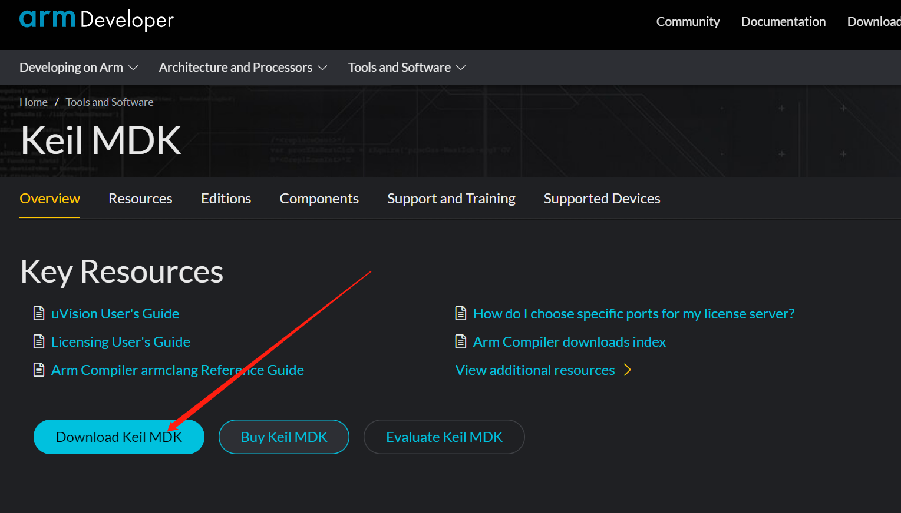

## 1.2.2 keil MDK5的安装

1. 双击运行下载的**mdk527.exe**软件开始安装:

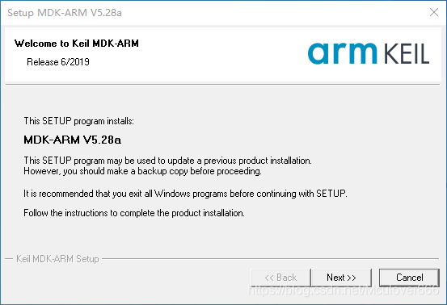

1. 点击**Next**进行下一步 &#x20;

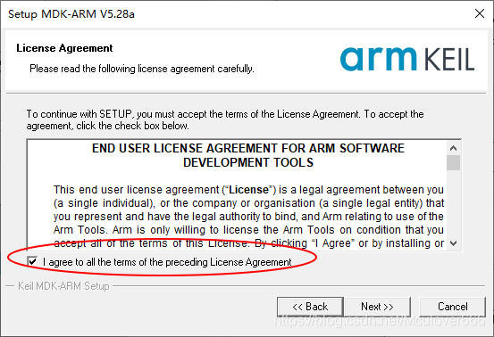

1. 选择MDK安装目录（不能有中文）： &#x20;

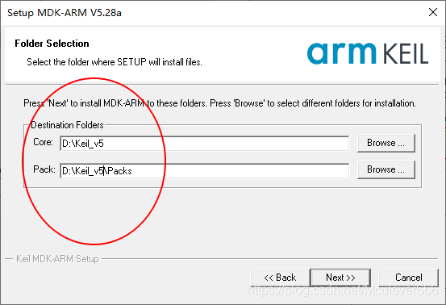

1. 随意填写即可  &#x20;

1. 继续点击**Next**进行下一步

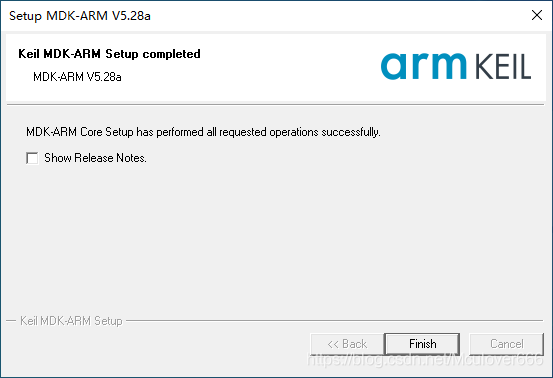

1. 点击**Finish**即可安装完成

安装完成后，桌面会生成快捷方式，打开就可以看到Keil MDK的主界面啦： 7. 点击快捷方式

1. 这是打开后的界面&#x20;

## 1.2.2 keil MDK5的破解

Keil MDK安装完成后，因为keil是收费的，所以我们平常学生个人使用可以使用破解器暂行破解，破解器下载链接：

* 链接：[https://pan.baidu.com/s/14OQ2IBiRJgH2ouJR94BVJw](https://pan.baidu.com/s/14OQ2IBiRJgH2ouJR94BVJw)
* 提取码：m356 &#x20;

这里为了躲避安全检查，打包成压缩包，破解软件会被当成病毒，所以在解压前必须关闭所有杀毒软件，包括Windows Defender!

1. 确认杀毒软件都关闭后，解压文件夹，然后打开破解软件 &#x20;

    (右键 - 以管理员身份运行)（温馨提示：打开前电脑最好静音）： &#x20;

    这里我们选择**ARM** &#x20;

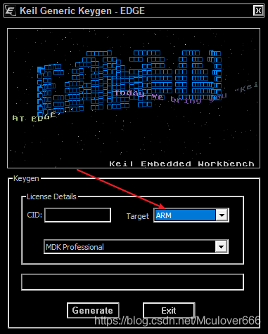

1. 然后我们再以**管理员身份**打开keil MDK，注意，一定要右键，以管理员身份打开：
2. 打开后，点击左上角**File**，进入**License Management**，复制CID：

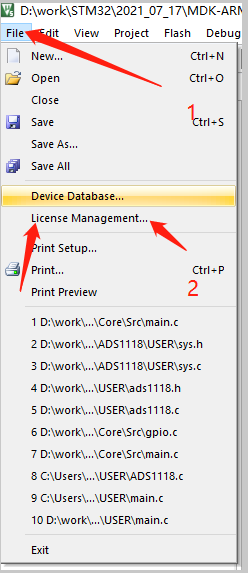

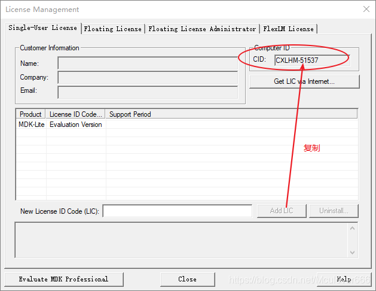

1. 粘贴到破解器的**CID**中，**TARGET**选项选择**ARM**，然后点击**Generate**生成激活码:&#x20;

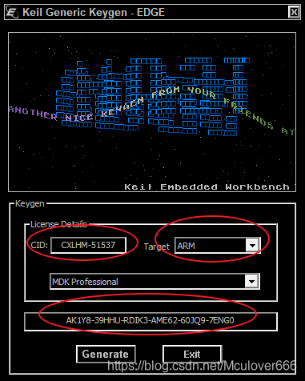

1. 将生成的激活码复制，粘贴到keil里，添加LIC：&#x20;

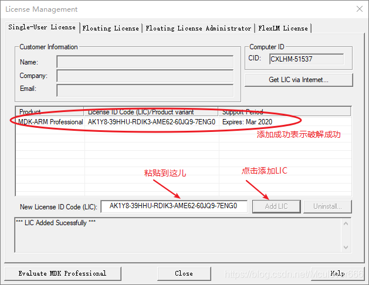

接下来就可以正常使用MDK了。

## 1.2.3 keil MDK5的使用技巧

### 文本美化

文本美化，主要是设置一些关键字、注释、数字等的颜色和字体。MDK 提供了我们自定义字体颜色的功能。

1. 我们可以在工具条上点击配置对话框弹出下图界面： &#x20;

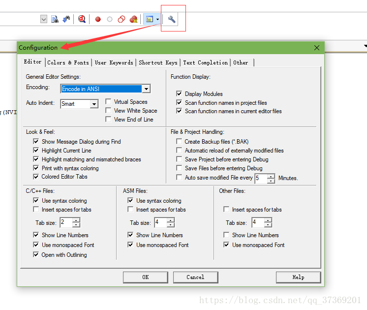

在该对话框中，先设置 **Encoding** 为:**Chinese GB2312(Simplified)**(本人使用的是UTF-8编码)，然后设置 **Tab size** 为：**4**。以更好的支持简体中文（否则，拷贝到其他地方的时候，中文可能是一堆的问号），同时 TAB 间隔设置为 4 个单位。

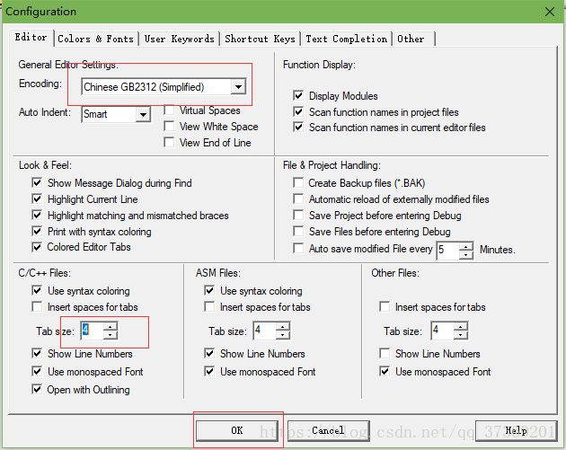

### 语法检测 & 代码提示

MDK4.70 以上的版本，新增了代码提示与动态语法检测功能，使得 MDK 的编辑器越来越好用了，这里我们简单说一下如何设置\
同样，点击配置对话框 ，打开配置对话框，选择 Text Completion选项卡。

.png>)

**Strut/Class Members**，用于开启结构体/类成员提示功能。\
**Function Parameters**，用于开启函数参数提示功能。\
Symbols after xx characters，用于开启代码提示功能，即在输入多少个字符以后，提示匹配的内容（比如函数名字、结构体名字、变量名字等），这里默认设置 3 个字符以后，就开始提示。 Strut/Class Members，用于开启结构体/类成员提示功能。

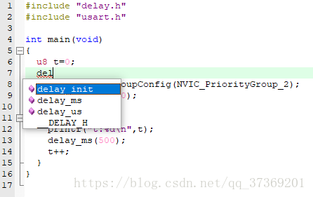

**Dynamic Syntax Checking**，则用于开启动态语法检测，比如编写的代码存在语法错误的时候，会在对应行前面出现“叉号”图标，如出现警告，则会出现“警告”图标，将鼠标光标放图标上面，则会提示产生的错误/警告的原因。

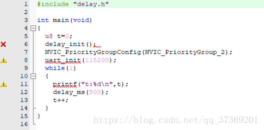

这几个功能，对我们编写代码很有帮助，可以加快代码编写速度，并且及时发现各种问题。不过这里要提醒大家，语法动态检测这个功能， 有的时候会误报如 （比如 sys.c 里面，就有很多误报），大家可以不用理会，只要能编译通过（0 错误），这样的语法误报，一般直接忽略即可。(也可以尝试重启软件)

### 代码编辑技巧

这里给大家介绍几个我常用的技巧，这些小技巧能给我们的代码编辑带来很大的方便，相信对你的代码编写一定会有所帮助。

#### TAB 键的妙用

首先要介绍的就是 **TAB** 键的使用，这个键在很多编译器里面都是用来空位的，每按一下移空几个位。如果你是经常编写程序的对这个键一定再熟悉不过了。但是 MDK 的 **TAB** 键和一般编译器的 TAB 键有不同的地方，和 C++的 **TAB** 键差不多。MDK 的 **TAB** 键支持块操作。也就是可以让一片代码整体右移固定的几个位，也可以通过 **SHIFT**+**TAB** 键整体左移固定的几个位。

假如我们的例程长这样：

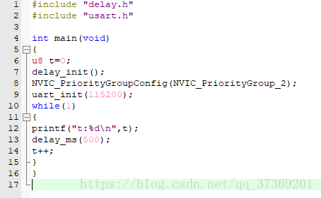

这样的代码大家肯定不会喜欢，这还只是短短的十来行代码，如果你的代码有几千行，全部是这个样子，不头大才怪。看到这样的代码我们就可以通过 TAB 键的妙用来快速修改为比较规范的代码格式。

选中一块然后按 TAB 键，你可以看到整块代码都跟着右移了一定距离：

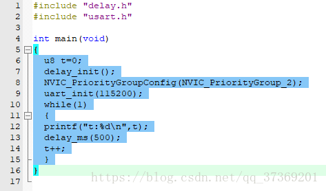

接下来我们就是要多选几次，然后多按几次 TAB 键就可以达到迅速使代码规范化的目的，最终效果如下：

经过这样的整理之后，整个代码一下就变得有条理多了，看起来很舒服

#### 快速定位函数 / 变量被定义的地方

大家在调试代码或编写代码的时候，一定有想看看某个函数是在那个地方定义的，具体里面的内容是怎么样的，也可能想看看某个变量或数组是在哪个地方定义的等。尤其在调试代码或者看别人代码的时候，如果编译器没有快速定位的功能的时候，你只能慢慢的自己找，代码量比较少还好，如果代码量一大，那就郁闷了，有时候要花很久的时间来找这个函数到底在哪里。

型号 MDK 提供了这样的快速定位的功能，只要你把光标放到这个函数/变量（xxx）的上面（xxx 为你想要查看的函数或变量的名字），然后右键，弹出下图所示的菜单栏 ：

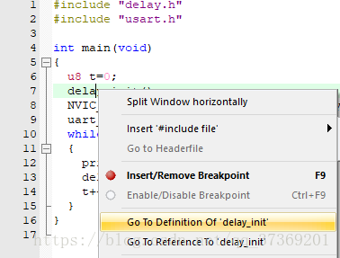

我们找到 Go to Definition Of‘delay\_init’ 这个地方，然后单击左键就可 以快速跳到 delay\_init 函数的定义处（注意要先在 Options for Target 的 Output 选项卡里面勾选Browse Information 选项，再编译，再定位，否则无法定位！）

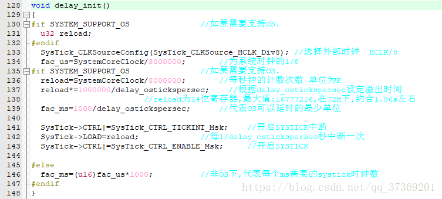

对于变量，我们也可以按这样的操作快速来定位这个变量被定义的地方，大大缩短了你查找代码的时间。细心的大家会发现上面还有一个类似的选项，就是 Go to Reference To‘delay\_init’，这个是快速跳到该函数被声明的地方，有时候也会用到，但不如前者使用得多。

很多时候，我们利用 Go to Definition/ Reference 看完函数/变量的定义/申明后，又想返回之前的代码继续看，此时我们可以通过 IDE 上的“返回”按钮（Back to previous position）快速的返回之前的位置，这个按钮非常好用！

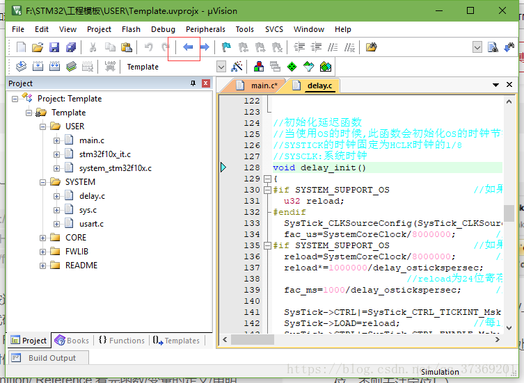

#### 快速注释与快速消注释

接下来，我们介绍一下快速注释与快速消注释的方法。在调试代码的时候，你可能会想注释某一片的代码，来看看执行的情况，MDK 提供了这样的快速注释/消注释块代码的功能。也是通过右键实现的。这个操作比较简单，就是先选中你要注释的代码区（这里假设全选），然后右键，选择**Advanced**->**Comment Selection** 就可以了。

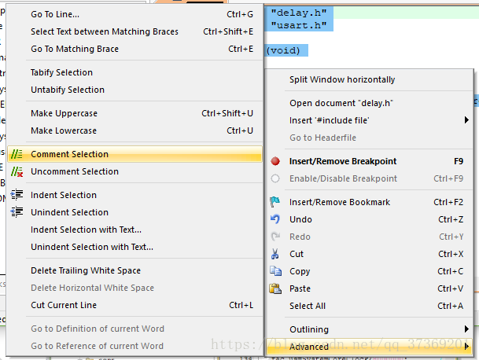

(顶部工具栏也有该按钮)

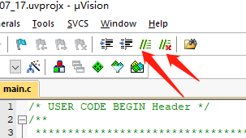

效果图如下:

这样就快速的注释掉了一片代码，而在某些时候，我们又希望这段注释的代码能快速的取消注释，MDK 也提供了这个功能。与注释类似，先选中被注释掉的地方，然后通过**右键**->**Advanced**，不过这里选择的是 **Uncomment Selection**。

#### 其他小技巧

除了前面介绍的几个比较常用的技巧，这里还介绍几个其他的小技巧，希望能让你的代码编写如虎添翼。

**第一个小技巧**是快速打开头文件。在将光标放到要打开的引用头文件上，然后右键选择 **OpenDocument “XXX”**，就可以快速打开这个文件了：（XXX 是你要打开的头文件名字）

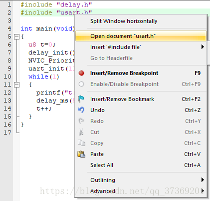

**第二个小技巧**是查找替换功能。这个和 WORD 等很多文档操作的替换功能是差不多的，在 MDK 里面查找替换的快捷键是“**CTRL**+**H**”，只要你按下该按钮就会调出如下界面：

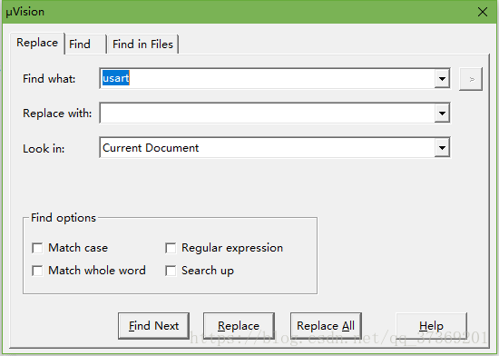

这个替换的功能在有的时候是很有用的，它的用法与其他编辑工具或编译器的差不多，不再多说。

**第三个小技巧**是跨文件查找功能，先双击你要找的函数/变量名（这里我们还是以系统时钟初始化函数：delay\_init 为例），接着按图中步骤：

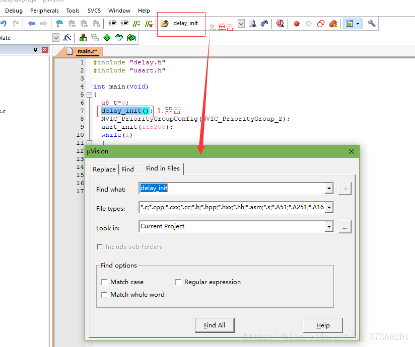

点击 Find，MDK 就会帮你找出所有含有 delay\_init 字段的文件并列出其所在位置。该方法可以很方便的查找各种函数/变量，而且可以限定搜索范围（比如只查找.c 文件和.h文件等），是非常实用的一个技巧。
