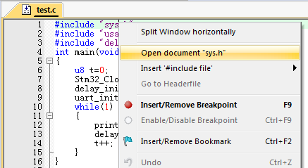

# 1.5. keil MDK5的使用技巧

这里给大家介绍几个我常用的技巧，这些小技巧能给我们的代码编辑带来很大的方便，相信对你的代码编写一定会有所帮助。

## 1.5.1. TAB 键的妙用

首先要介绍的就是 **TAB** 键的使用，这个键在很多编译器里面都是用来空位的，每按一下移空几个位。如果你是经常编写程序的对这个键一定再熟悉不过了。但是 MDK 的 **TAB** 键和一般编译器的 TAB 键有不同的地方，和 C++的 **TAB** 键差不多。MDK 的 **TAB** 键支持块操作。也就是可以让一片代码整体右移固定的几个位，也可以通过 **SHIFT**+**TAB** 键整体左移固定的几个位。

假如我们的例程长这样：

这样的代码大家肯定不会喜欢，这还只是短短的十来行代码，如果你的代码有几千行，全部是这个样子，不头大才怪。看到这样的代码我们就可以通过 TAB 键的妙用来快速修改为比较规范的代码格式。

选中一块然后按 TAB 键，你可以看到整块代码都跟着右移了一定距离：

接下来我们就是要多选几次，然后多按几次 TAB 键就可以达到迅速使代码规范化的目的，最终效果如下：

经过这样的整理之后，整个代码一下就变得有条理多了，看起来很舒服

## 1.5.2. 快速定位函数 / 变量被定义的地方

大家在调试代码或编写代码的时候，一定有想看看某个函数是在那个地方定义的，具体里面的内容是怎么样的，也可能想看看某个变量或数组是在哪个地方定义的等。尤其在调试代码或者看别人代码的时候，如果编译器没有快速定位的功能的时候，你只能慢慢的自己找，代码量比较少还好，如果代码量一大，那就郁闷了，有时候要花很久的时间来找这个函数到底在哪里。

型号 MDK 提供了这样的快速定位的功能，只要你把光标放到这个函数/变量（xxx）的上面（xxx 为你想要查看的函数或变量的名字），然后右键，弹出下图所示的菜单栏 ：

我们找到 **Go to Definition Of delay\_init** 这个地方，然后单击左键就可 以快速跳到 delay\_init 函数的定义处（注意要先在 **Options for Target** 的 **Output** 选项卡里面勾选**Browse Information** 选项，再编译，再定位，否则无法定位！）

对于变量，我们也可以按这样的操作快速来定位这个变量被定义的地方，大大缩短了你查找代码的时间。细心的大家会发现上面还有一个类似的选项，就是 **Go to Reference To‘delay\_init’**，这个是快速跳到该函数被声明的地方，有时候也会用到，但不如前者使用得多。

很多时候，我们利用 **Go to Definition/ Reference** 看完函数/变量的定义/申明后，又想返回之前的代码继续看，此时我们可以通过 IDE 上的按钮（**Back to previous position**）快速的返回之前的位置，这个按钮非常好用！

## 1.5.3. 快速注释与快速消注释

接下来，我们介绍一下快速注释与快速消注释的方法。在调试代码的时候，你可能会想注释某一片的代码，来看看执行的情况，MDK 提供了这样的快速注释/消注释块代码的功能。也是通过右键实现的。这个操作比较简单，就是先选中你要注释的代码区（这里假设全选），然后右键，选择**Advanced**->**Comment Selection** 就可以了。

以**Stm32_Clock_Init**函数为例，比如我要注释掉下图中所选中区域的代码

我们只要在选中了之后，选择右键，再选择
**Advanced**->**Comment Selection**就可以把这段代
码注释掉了。

效果图如下:

这样就快速的注释掉了一片代码，而在某些时候，我们又希望这段注释的代码能快速的取消注释，MDK 也提供了这个功能。与注释类似，先选中被注释掉的地方，然后通过**右键**->**Advanced**，不过这里选择的是 **Uncomment Selection**。

(顶部工具栏也有该按钮)

## 1.5.4. 其他小技巧

除了前面介绍的几个比较常用的技巧，这里还介绍几个其他的小技巧，希望能让你的代码编写如虎添翼。

### 1.5.4.1 第一个小技巧

是快速打开头文件。在将光标放到要打开的引用头文件上，然后右键选择 **OpenDocument “XXX”**，就可以快速打开这个文件了：（XXX 是你要打开的头文件名字）

### 1.5.4.2. 第二个小技巧

是查找替换功能。这个和 WORD 等很多文档操作的替换功能是差不多的，在 MDK 里面查找替换的快捷键是“**CTRL**+**H**”，只要你按下该按钮就会调出如下界面：

这个替换的功能在有的时候是很有用的，它的用法与其他编辑工具或编译器的差不多，不再多说。

### 1.5.4.3. 第三个小技巧

是跨文件查找功能，先双击你要找的函数/变量名（这里我们还是以系统时钟初始化函数：delay\_init 为例），接着按图中步骤：

点击 Find，MDK 就会帮你找出所有含有 delay\_init 字段的文件并列出其所在位置。该方法可以很方便的查找各种函数/变量，而且可以限定搜索范围（比如只查找.c 文件和.h文件等），是非常实用的一个技巧。
