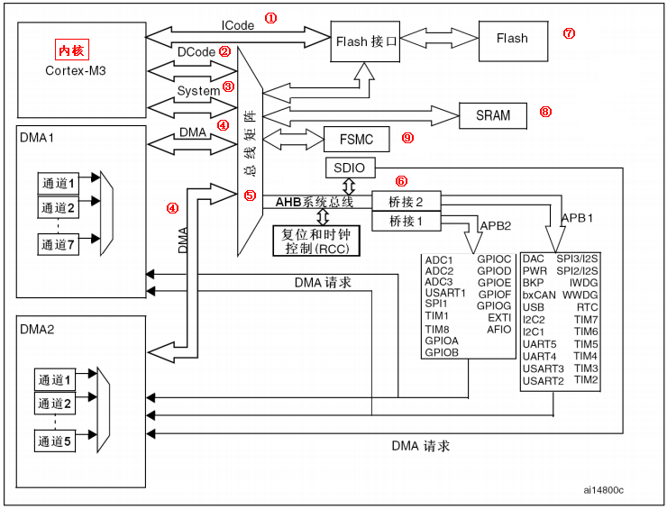

# 2.2 STM32F1系统架构

STM32的系统架构比 51单片机就要强大很多了。 STM32系统架构的知识可以在**《 STM32中文参考手册 V10》**的 P25\~28有讲解，这里我们也把这一部分知识抽取出来讲解，是为了大 家在学习 STM32之前对系统架构有一个初步的了解。这里的内容基本也是从中文参考手册中 参考过来的，让大家能通过我们手册也了解到，免除了到处找资料的麻烦吧。如果需要详细深 入的了解 STM32的系统架构，还需要在网上搜索其他资料学习学习。

我们这里所讲的 STM32系统架构主要针对的 STM32F103这些非互联型芯片。首先我们看 看 STM32的系统架构图：

STM32主系统主要由四个驱动单元和四个被动单元构成。

**四个驱动单元是：**

* 内核DCode总线 ; &#x20;
* 系统总线; &#x20;
* 通用DMA1; &#x20;
* 通用DMA2; &#x20;

**四被动单元是：**

* AHB到 APB的桥：连接所有的 APB设备；
* 内部FlASH闪存；
* 内部SRAM
* FSMC;

下面我们具体讲解一下图中几个总线的知识：

① ICode总线：该总线将 M3内核指令总线和闪存指令接口相连，指令的预取在该总线上 面完成。\
② DCode总线：该总线将 M3内核的 DCode总线与闪存存储器的数据接口相连接，常量 加载和调试访问在该总线上面完成。\
③ 系统总线：该总线连 接 M3内核的系统总线到总线矩阵，总线矩阵协调内核和 DMA间 访问。\
④ DMA总线：该总线将 DMA的 AHB主控接口与总线矩阵相连，总线矩阵协调 CPU的 DCode和 DMA到 SRAM,闪存和外设的访问。\
⑤ 总线矩阵：总线矩阵协调内核系统总线和 DMA主控总线之间的访问仲裁，仲裁利用 轮换算法。\
⑥ AHB/APB桥 :这两个桥在 AHB和 2个 APB总线间提供同步连接， APB1操作速度限于 36MHz,APB2操作速度全速。

**对于系统架构的知识，在刚开始学习STM32的时候只需要一个大概的了解，大致知道是个什么情况即可。对于寻址之类的知识，这里就不做深入的讲解，中文参考手册都有很详细的讲解。**
