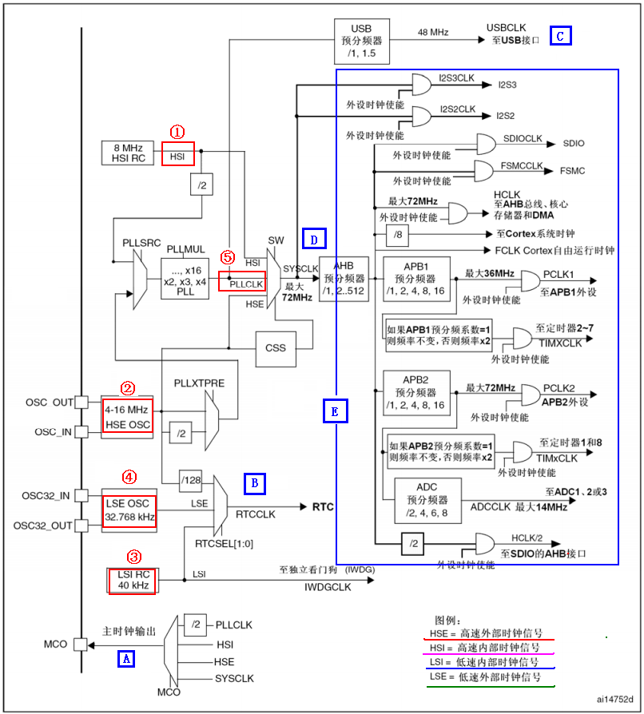

# 2.3 STM32F103时钟系统

STM32F1时钟系统的知识在 **《 STM32 中文参考手册 V1.0 》**第六章复位和时钟控制章节有非 常详细的讲解，网上关于时钟系统的讲解也基本都是参考的这里。这些知识也不是什么原创， 纯粹根据官方提供的中文参考手册和自己的应用心得来总结的，如有不合理之处望大家谅解。\
这部分内容我们分3个小节来讲解：

* STM32F103时钟树概述
* STM32F103时钟初始化配置
* STM32F103时钟使能和配置

## 2.3.1 STM32F103时钟树概述

众所周知，时钟系统是CPU的脉搏，就像人的心跳一样。所以时钟系统的重要性就不言而 喻了。 STM32F103的时钟系统比较复杂，不像简单的 51单片机一个系统时钟就可以解决一切。 于是有人要问，采用一个系统时钟不是很简单吗？为什么 STM32要有多个时钟源呢？ **因为首 先 STM32本身非常复杂，外设非常的多，但是并不是所有外设都需要系统时钟这么高的频率， 比如看门狗以及 RTC只需要几十 k的时钟即可。同一个电路，时钟越快功耗越大，同时抗电磁 干扰能力也会越弱，所以对于较为复杂的 MCU一般都是采取多时钟源的方法来解决这些问题。**

首先让我们来看看STM32F103的时钟系统图：

在STM32中，有五个时钟源，为 **HSI(高速内部时钟)**、 **HSE(高速外部时钟信号)**、**LSI(低速内部时钟信号)**、 **LSE(低速外部时钟信号)**、 **PLL(锁相环倍频输出)**

从**时钟频率**来分可以分为**高速时钟源**和**低速时钟源**，在这 5个中 HSI HSE以及 PLL是高速时钟， LSI和 LSE是低速时钟。从来源可分为外部时钟源和内部时钟源，外部时钟源就是从外部通过接晶振的方式获取时钟 源，其中 HSE和 LSE是外部时钟源，其他的是内部时钟源。下面我们看看 STM32的 5个时钟源，我们讲解顺序是按图中红圈标示的顺序：

① 、 HSI是高速内部时钟， RC振荡器，频率为 8MHz。\
② 、 HSE是高速外部时钟，可接石英 /陶瓷谐振器，或者接外部时钟源，频率范围为 4MHz\~16MHz。 我们的开发板接的是 8M的晶振。\
③ 、 LSI是低速内部时钟， RC振荡器，频率为 40kHz。 独立看门狗的时钟源只能是 LSI，同 时LSI还可以作为 RTC的时钟源。\
④ 、 LSE是低速外部时钟，接频率为 32.768kHz的石英晶体。 这个主要是 RTC的时钟源。\
⑤ 、 PLL为锁相环倍频输出，其时钟输入源可选择为 HSI/2、 HSE或者 HSE/2。倍频可选择为2\~16倍，但是其输出频率最大不得超过 72MHz。

上面我们简要概括了STM32的时钟源，那么这 5个时钟源是怎么给各个外设以及系统提供时钟的呢？这里我们将一一讲解。我们还是从图的下方讲解起吧，因为下方比较简单。图中我们用A \~E标示我们要讲解的地方。

A. MCO是 STM32的一个时钟输出 IO(PA8)，它可以选择一个时钟信号输出 可以 选择为 PLL输出的 2分频、 HSI、 HSE、或者系统时钟 。这个时钟可以用来给外 部其他系统提供时钟源。

B. 这里是 RTC时钟源，从图上可以看出， RTC的时钟源可以选择 LSI LSE，以及 HSE的 128分频。

C. 从图中可以看出 C处 USB的时钟是来自 PLL时钟源。 STM32中有一个全速功能 的 USB模块，其串行接口引擎需要一个频率为 48MHz的时钟源。该时钟源只能 从 PLL输出端获取，可以选择为 1.5分频或者 1分频，也就是，当需要使用 USB模块时， PLL必须使能，并且时钟频率配置为 48MHz或 72MHz。

D. D处就是 STM32的系统时钟 SYSCLK，它 是供 STM32中绝大部分部件工作的时 钟源 。 系统时钟可选择为 PLL输出、 HSI或者 HSE。系统时钟最大频率 为 72MHz 当然你也可以超频，不过一般情况为了系统稳定性是没有必要冒风险去超频的。

E. 这里的 E处是指其他所有外设了。从时钟图上可以看出，其他所有外设的时钟最 终来源都是 SYSCLK。 SYSCLK通过 AHB分频器分频后送给各模块使用 。这些模块包 括：

①、 AHB总线、内核、内存和 DMA使用的 HCLK时钟。\
② 、通过 8分频后送给 Cortex的系统定时器时钟 ，也就是 systick了 。\
③ 、直接送给 Cortex的空闲运行时钟 FCLK。\
④ 、送给 APB1分频器。 APB1分频器输出一路供 APB1外设使用 (PCLK1，最大频率 36MHz)，另一路送给定时器 (Timer)2、 3、 4倍频器使用。\
⑤、送给 APB2分频器。 APB2分频器分频输出一路供 APB2外设使用 (PCLK2最大频率 72MHz)，另一路送给定时器 (Timer)1倍频器使用。

其中需要理解的是APB1和 APB2的区别， APB1上面连接的是低速外设，包括 电源接口、备份接口、 CAN、 USB、 I2C1、 I2C2、 UART2、 UART3等等， APB2上面 连接的是高速外设包括 UART1、 SPI1、 Timer1、 ADC1、 ADC2、所有普通 IO口 (PA\~PE)、第二功能 IO口 等。居宁老师的《稀里糊涂玩 STM32》资料里面教大家的记忆方法是 2>1 APB2下面所挂的外设的时钟要比 APB1的高。

在以上的时钟输出中，有很多是带使能控制的，例如AHB总线时钟、内核时钟、各种 APB1外设、 APB2外设等等。当需要使用某模块时，记得一定要先使能对应的时钟。 后面我们讲解实例的时候回讲解到时钟使能的方法。

## 2.3.2 STM32F103时钟系统配置

上一小节我们对STM32F103时钟树进行了详细讲解，接下来我们通过图形化配置工具 STM32CubeMX来配置生成，放在第三章进行演示

接下来的内容均为实际工程演示,以上内容较为枯燥与复杂,读者可以暂不细读.
