# 3.1 跑马灯实验

硬件平台：stm32F103RCT6 (正点原子 mini开发板)\
软件平台：stm32cubeMX 6.2.1 + MDK5.15

以后均是该平台,本篇之后不再赘述

本篇分为三个部分:

* 硬件设计
* 软件设计
* 下载验证

## 3.1.1 硬件设计

本章用到的硬件只有**LED** (**DS0**和 **DS1**）。其 电路在 ALIENTEK MiniSTM32开发板上 默认 是 已经连接好了 的 。 **DS0**接 **PA8**, **DS1**接 **PD2**。所以在硬件上不需要动任何东西。

其连接原理图如下：

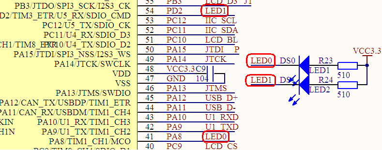

## 3.1.2 软件设计

本章实验顺序基本上是参考与**<< STM32不完全手册HAL库版本 >>**,略有删减.但本文是采用了STM32CuBeMX图形化配置工具进行初始化的.所以内容与**<< STM32不完全手册HAL库版本 >>**相比 较为简单与浅显.

### 创建工程

这是我们学习的第一个实验,所以我会手把手的教大家从头创建工程, 之后就不再讲解如何创建工程了.忘记的读者可以回到此处再次查看.

1. 打开STM32CubeMX

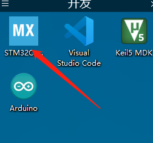

1.  打开后我们会看到以下界面,点击 **Start My project from MCU**  来选择我们的MCU型号来创建工程 &#x20;

    (我们mini开发板采用的MCU是STM32F103RCT6)

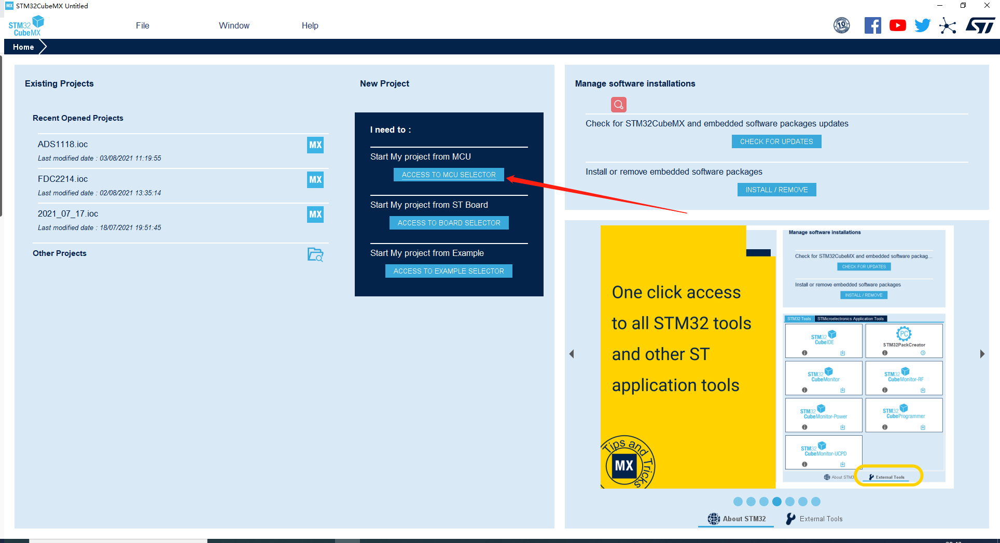

1. 在此处填入我们的芯片型号**stm32f103rc**并双击**STM32F103RCTx**(箭头所指位置)

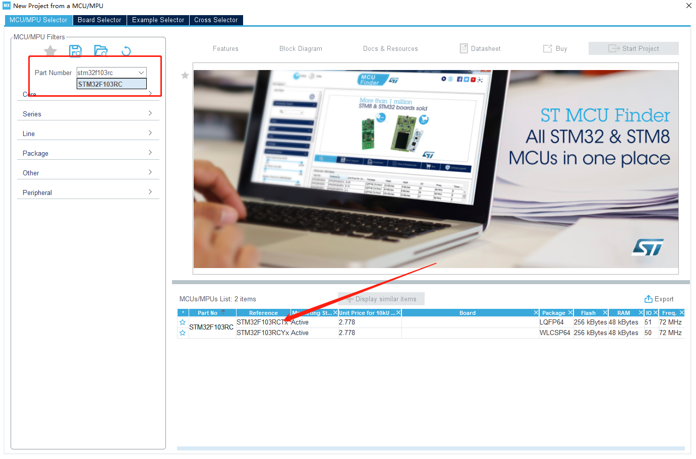

1.  选择完芯片后我们点击**File** - **Save Project**来保存当前工程 &#x20;

    也可以稍后再保存,但是还是建议创建了工程就保存.  &#x20;

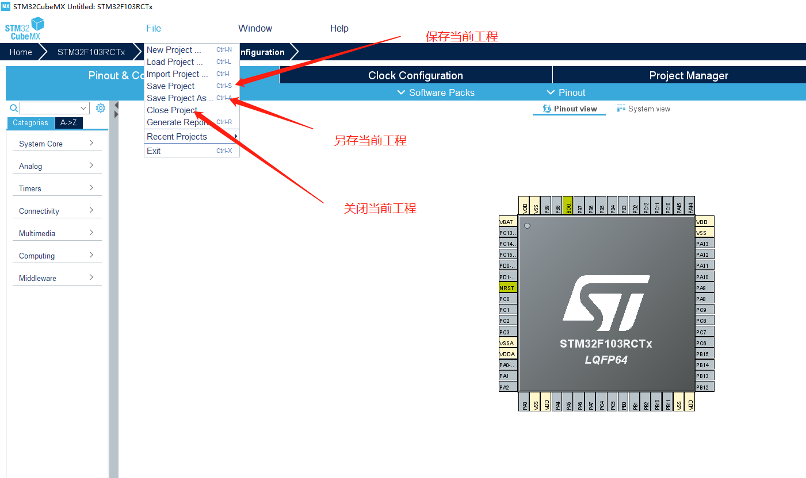

1. 点击**保存**后会弹出以下窗口:&#x20;

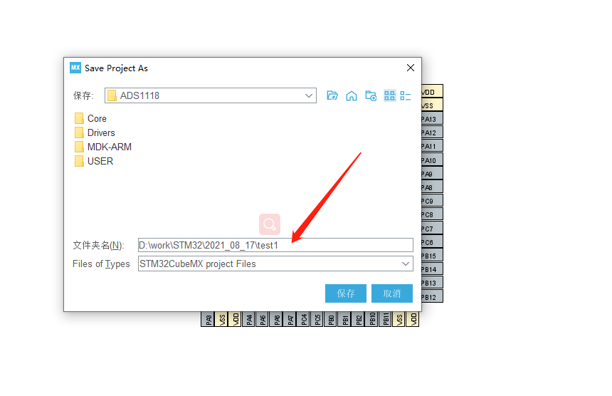

以截图为例, 箭头处填入工程保存的路径, 点击**保存**按钮即可,(最后的**test1**为工程名)\
(建议创建一个**work**或者**stm32**的文件夹专门用来放工程)

### 配置芯片

1.  配置**RCC**, 时钟源选择 &#x20;

    这里使用的是配置了**外部高速时钟**&#x20;

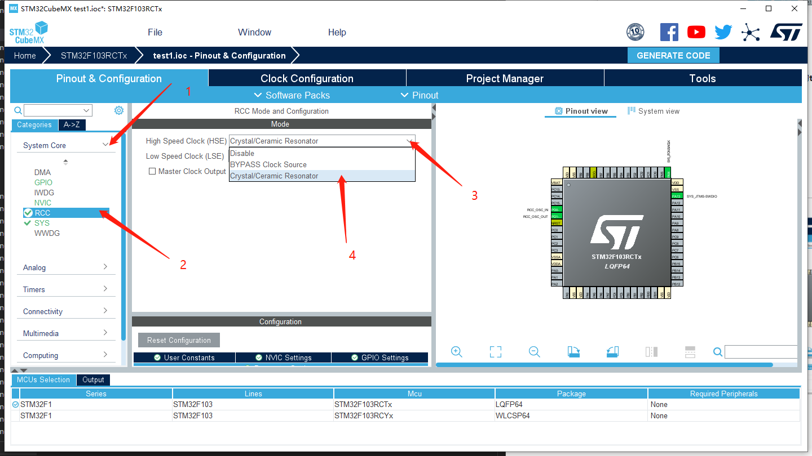

1.  配置SYS, 配置下载接口 &#x20;

    这里使用的是**SWD**(Serial Wire Debug)方式下载 &#x20;


1.  配置PA8引脚为输出模式 &#x20;

    如图:  &#x20;

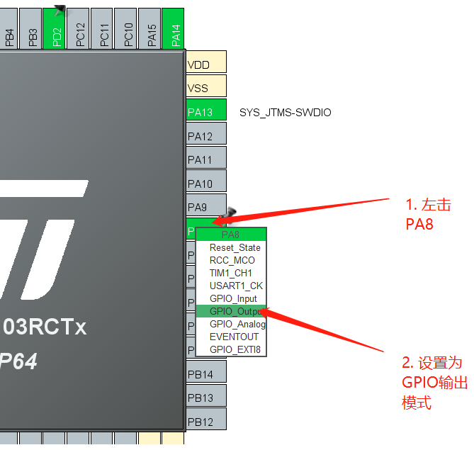

1. 给PA8引脚设置一个用户标签LED0(方便我们使用与记忆) &#x20;

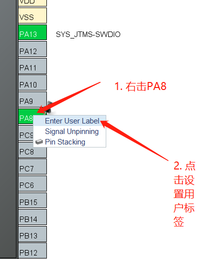

1. 设置IDE(集成开发环境)为 MDK5 &#x20;

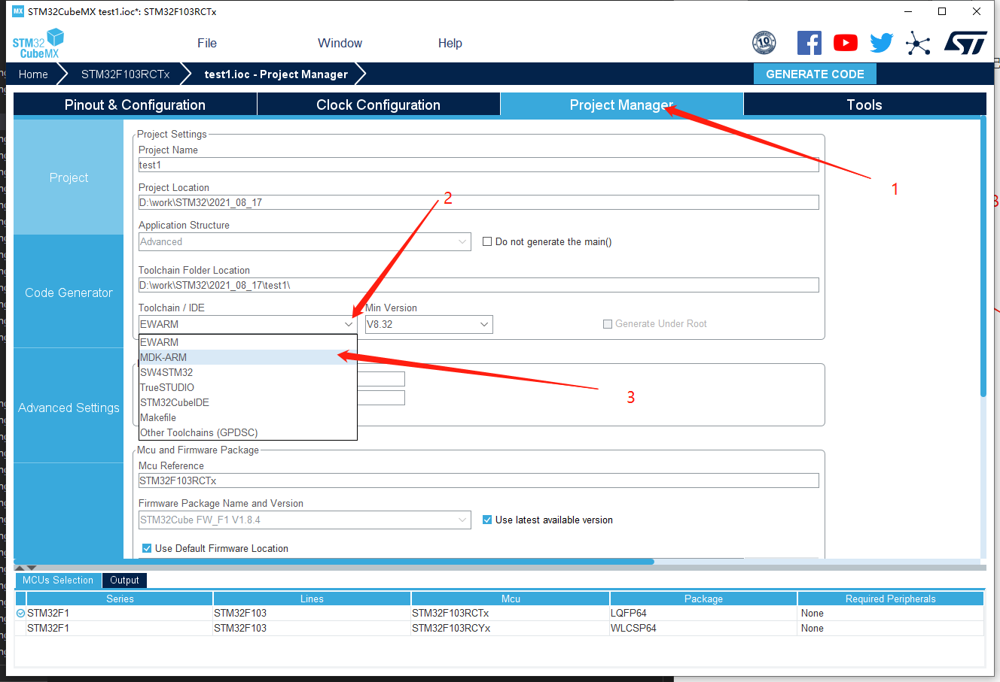

1. 配置工程代码生成选项 &#x20;

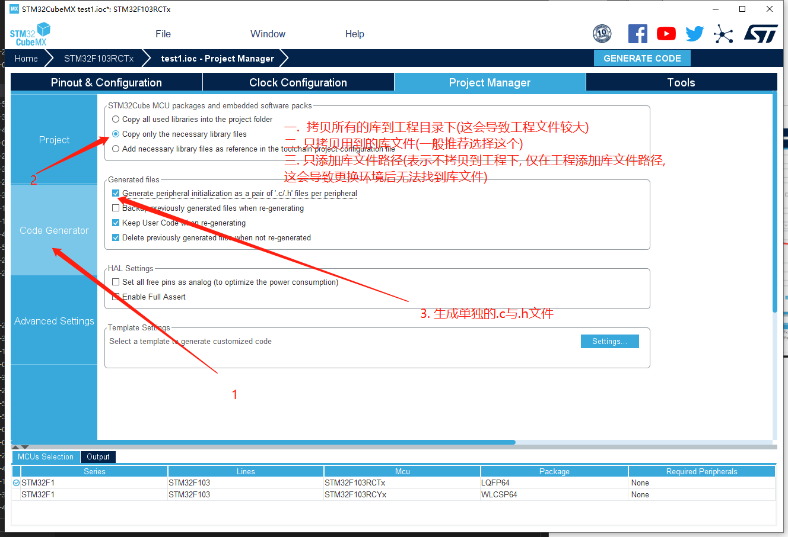

1. 点击生成按钮后打开工程,具体如图: &#x20;

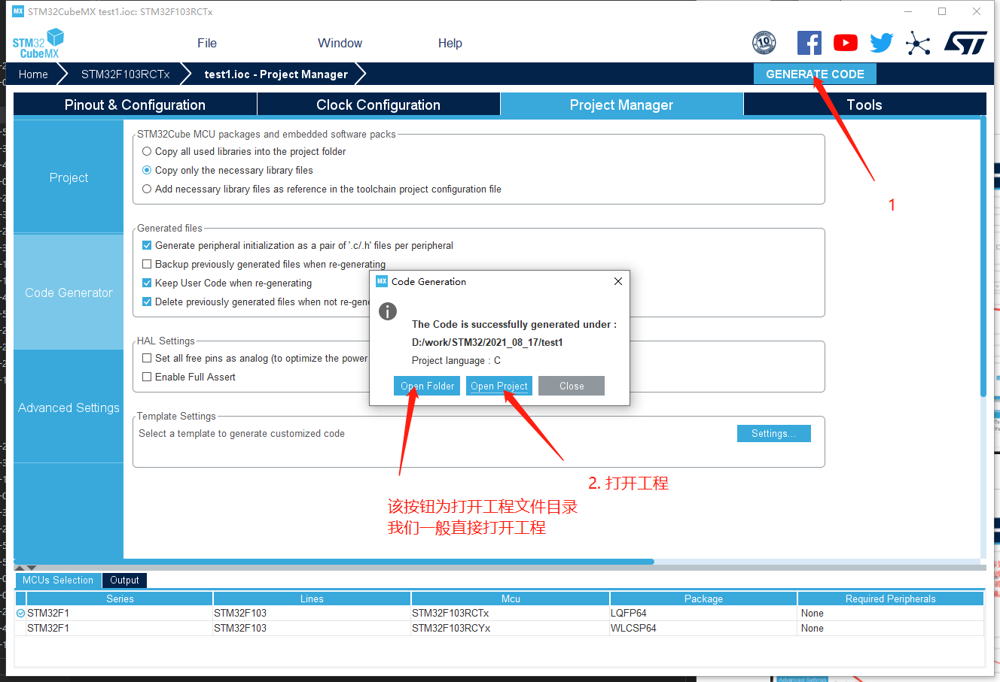

### 编写程序

现在我们用keil5打开了工程,建议进行一次全局编译.具体如图


我们将代码写在**whil(1)**循环内, 因为我们需要一直执行这段代码\
(注意: 我们需要将代码写在**BEGIN**与**END**之间, 防止使用CuBeMX再次生成后导致代码消失)

程序流程图,如下:

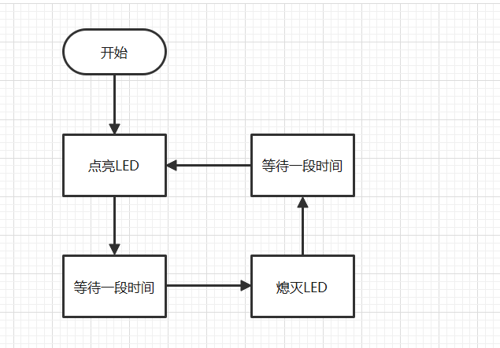

代码如下:

```c
HAL_GPIO_WritePin(LED0_GPIO_Port,LED0_Pin,0); //将LED0引脚写入一个低电平
HAL_Delay(500);//等待500ms
HAL_GPIO_WritePin(LED0_GPIO_Port,LED0_Pin,1);//将LED0引脚写入一个高电平
HAL_Delay(500);
```

这样一个最基础的实验我们就完成了 实现的效果就是D0亮500ms灭500ms

关于高电平点亮LED还是低电平点亮LED需要结合电路图\
电路图在上方

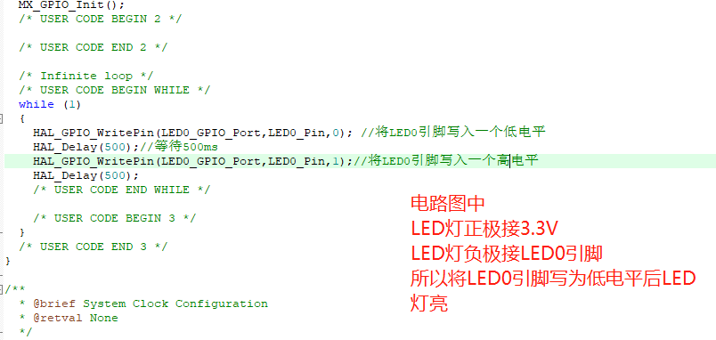

## 3.1.3 下载验证

编写完工程后我们点击编译,等待编译完成后进行下载.\
下载完成后,我们按下开发板上的复位按钮, 可以看到, 开发板上的D0亮500ms灭500ms

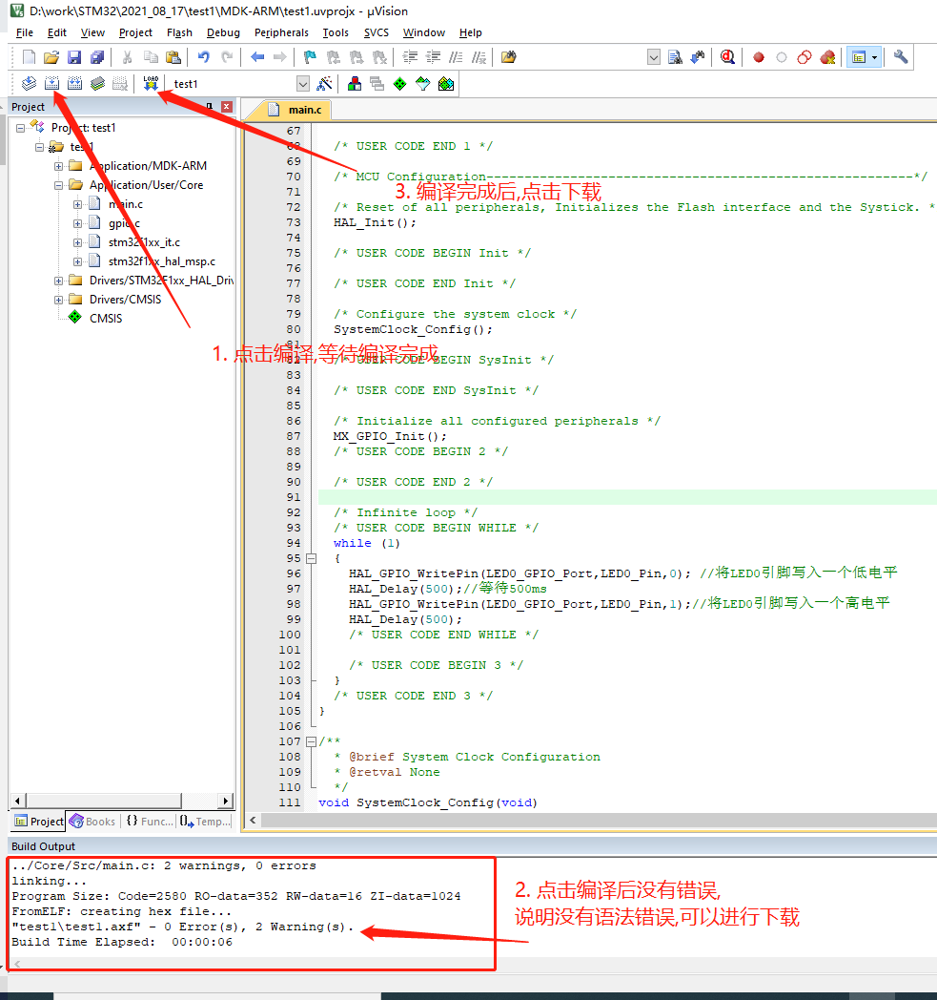
