# 3.4 串口实验

前面两章介绍了 STM32的 IO口操作 。这一章 我们将学习 STM32的串口 ，教大家如何使用 STM32的串口来发送和接收数据 。 本章将实现如下功能： STM32通过串口和上位机的对话，STM32在收到上位机发过来的字符串后，原原本本的返回给上位机。

本章 分为如下几个小节：

* 3.4.1 STM32串口简介
* 3.4.2 硬件设计
* 3.4.3 软件设计
* 3.4.4 下载 验证

## 3.4.1 STM32串口简介

串口作为 MCU的重要外部接口，同时也是软件开发重要的调试手段， 其重要性不言而喻。 现在基本上所有的 MCU都会带有串口， STM32自然也不例外。

### 串口数据接收和发送

**STM32F1**的发送与接收是通过数据寄存器 **USART\_DR**来实现的，这是一个双寄存器，包含了 **TDR**和 **RDR**。当向该寄存器写数据的时候，串口就会自动发送，当收到数据的时候，也是存在该寄存器内。\
HAL库操作 USART\_DR寄存器发送数据的函数是：

`HAL_UART_Transmit(UART_HandleTypeDef *huart, uint8_t *pData, uint16_t Size, uint32_t Timeout);`

通过该函数向串口寄存器USART\_DR写入一个数据。

HAL库操作 USART\_DR寄存器读取串口接收到的数据的函数是：

`HAL_UART_Receive(UART_HandleTypeDef *huart, uint8_t *pData, uint16_t Size, uint32_t Timeout);`

通过该函数可以读取串口接受到的数据。

**(但是这个读取串口接收到的数据, 限制了长度. 但是在很多时候, 我们并不知道会接收到几个字节的数据)**

## 3.4.2 硬件设计

本实验需要用到的硬件资源有：\
1\. 指示灯 DS0\
2\. 串口 1

串口1之前还没有介绍过，本实验用到的 串口1与 USB串口并没有在 PCB上连接在一起，需要通过跳线帽来连接一下。这里我们把 **P4**的 **RXD**和 **TXD**用跳线帽与 **PA9**和 **PA10**连接起来。

如 图所示：

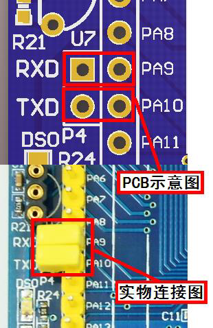

连接上这里之后，我们在硬件上就设置完成了，可以开始软件设计

## 3.4.3 软件设计

本章的代码设计，比前两章复杂很多，因为我们的串口接收代码是用我们自己写的函数.

### 配置芯片

1. 配置**RCC**, 配置**SYS**与**3.1 跑马灯实验** 相同, 所以本篇不再赘述
2. 配置LED灯的方法与3.3 中相同, 所以本篇同样不再赘述
3. 我们直接开始配置串口, 本篇所演示采用的串口1, 其他串口同理

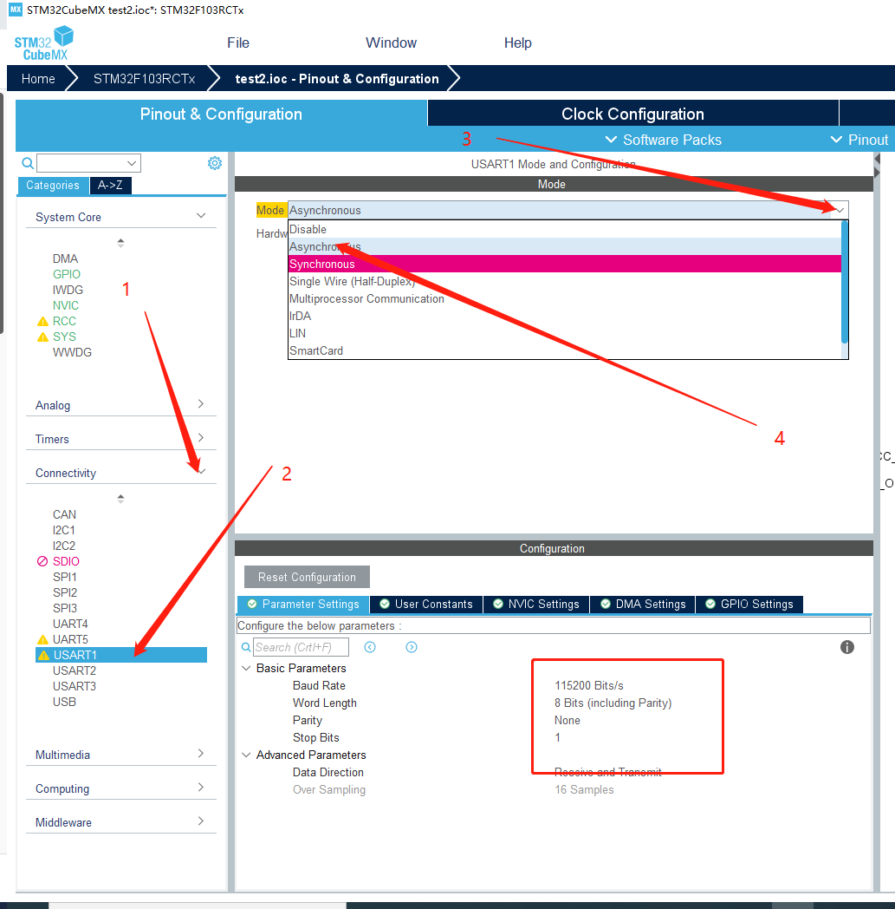

这样我们配置好了, 串口1设置为异步通讯, 波特率为115200

1. 因为我们需要接收数据, 所以我们需要使能中断

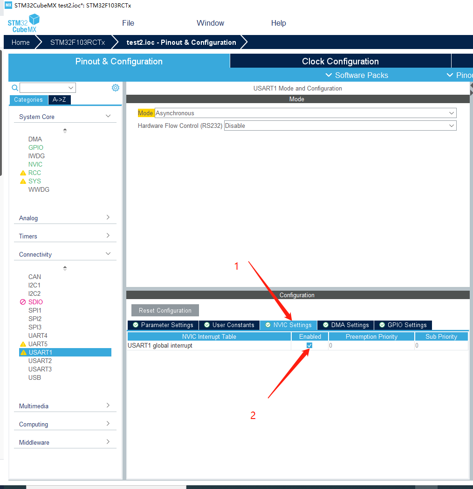

1. 至此,我们就已经配置完成本篇工程所需要的, 我们点击生成代码即可

### 编写代码

C语言中printf函数默认输出设备是显示器，如果要实现在 串口或者LCD上显示，必须重定义标准库函数里调用的与输出设备相关的 函数。比如使用printf输出到串口，需要将fputc里面的输出指向串口, 这一过程就叫重定向。

1. 我们在**usart.c**中编写重定向代码

重定向代码如下:

```c
int fputc(int ch, FILE *f)
{
    HAL_UART_Transmit(&huart1, (uint8_t *)&ch, 1, 0xffff);
    return ch;
```

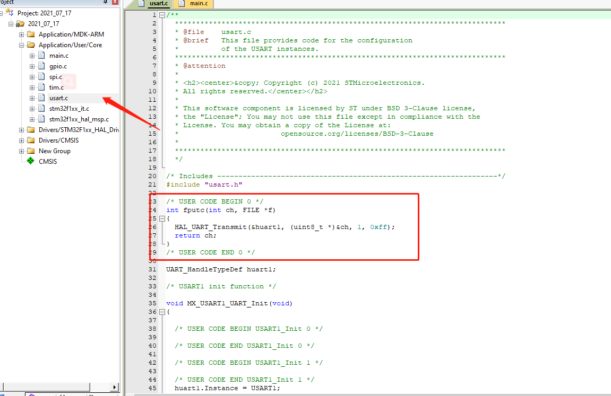

1. 我们在**usart.h**中增加头文件

`#include "stdio.h"`

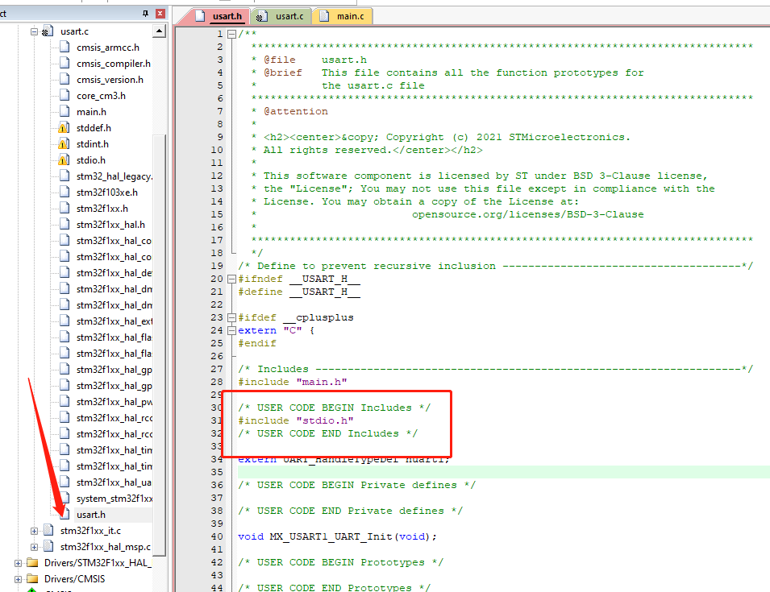

至此我们就已经成功的printf输出指向到串口, 为了检查串口是否正确配置,我们增加一行测试代码

1. 串口输出测试

`printf("hello, world\r\n");`

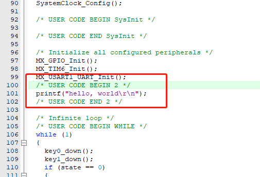

我们进行编译然后下载测试, 可以看到串口调试助手显示了 hello, world

**接下来我们开始编写串口接收代码**

1. 我们定义几个变量,来存放计数与标志位和接收到的数据

```c
uint8_t rx_buff[128]; //串口1接收缓存
uint8_t buff_i;
uint8_t flag_rx;
```

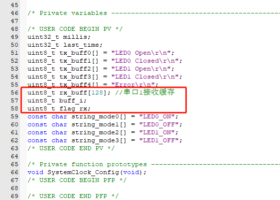

1. 我们修改一下串口接收中断

`UART_IRQHandler`();

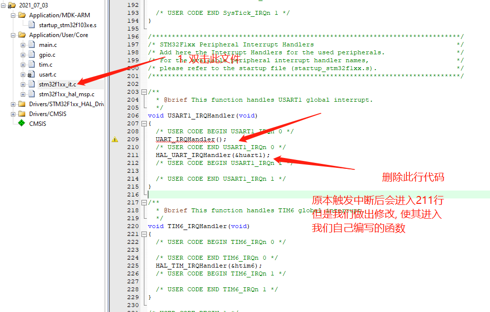

1. 我们编写一下串口接收函数

代码逻辑如下:

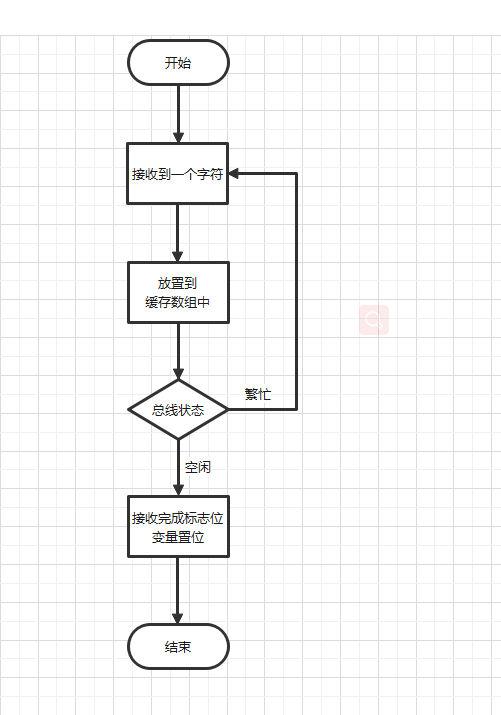

代码如下:

```c
// RXNE：当RDR移位寄存器中的数据被转移到USART_DR寄存器中,该位被硬件置位 如果USART_CR1寄存器中的RXNE不为空,则产生中断
// DR 数据寄存器
void UART_IRQHandler(void)
{
    if (__HAL_UART_GET_FLAG(&huart1, UART_FLAG_RXNE) != RESET) // 数据已经保存到DR寄存器中 
    {
        __HAL_UART_ENABLE_IT(&huart1, UART_IT_IDLE);              //使能空闲中断
        rx_buff[buff_i] = (uint8_t)(huart1.Instance->DR & (uint8_t)0xff); //将DR 数据寄存中的低八位数据放入接收数组
        buff_i++;
        __HAL_UART_CLEAR_FLAG(&huart1, UART_FLAG_RXNE); //清除数据标志位
    }
    if (__HAL_UART_GET_FLAG(&huart1, UART_FLAG_IDLE) != RESET) //空闲标志位不为空  表示已经空闲 数据已经读完 发送完一帧数据后 该标志位置位
    {
        __HAL_UART_DISABLE_IT(&huart1, UART_IT_IDLE); //关闭空闲中断
        flag_rx = 1;                                  //接收完成
    }
}
```

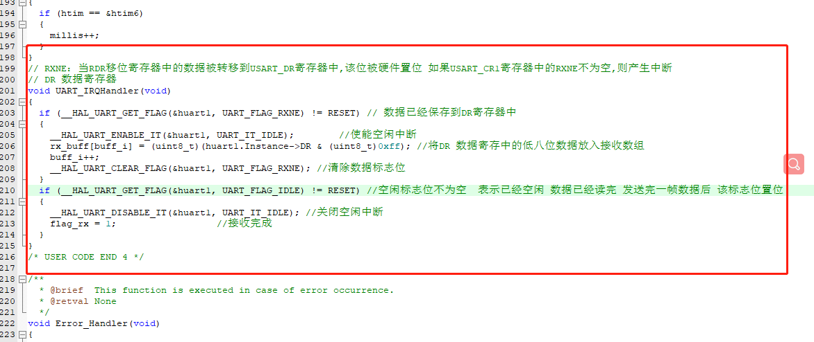

1. 添加主体代码

将接收到的数据, 打印出来

```c
if (flag_rx == 1) //一针数据接收完成
{  
    printf(rx_buff); //将接收到的数据打印至屏幕上

    // 数据处理完成 清空缓存 等待下次接收
    flag_rx = 0;
    buff_i = 0;
    memset(rx_buff, 0, 128);
}
```

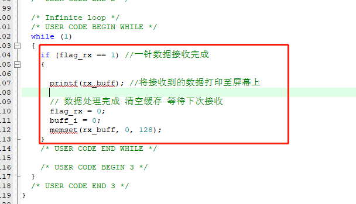

## 3.4.4 下载验证

编写完工程后我们点击编译,等待编译完成后进行下载.\
下载完成后,我们按下开发板上的复位按钮, 可以看到, 我们通过串口调试助手向开发板发送什么, 开发板就会回我们什么


