# 1.1 STM32CubeMX

## 1.1.1 STM32CubeMX的介绍

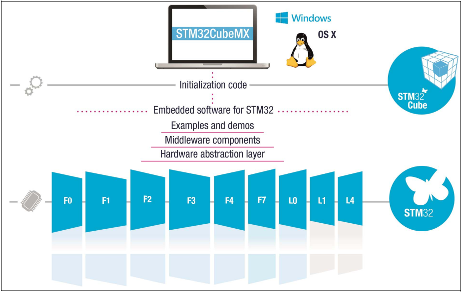

STM32CubeMX是一个图形化的工具，也是配置和初始化C代码生成器（STM32 configuration and initialization C code generation），也就是自动生成开发初期关于芯片相关的一些初始化代码。

从上图可以看得出，它包含了STM32所有系列的芯片，包含示例和样本（Examples and demos）、中间组件（Middleware Components）、硬件抽象层（Hardwaree abstraction layer）。

**STM32CubeMX的特性如下:**

* 直观的选择 STM32 微控制器。
* 微控制器图形化配置：
* 自动处理引脚冲突
* 动态设置确定的时钟树
* 可以动态确定参数设置的外围和中间件模式和初始化
* 功耗预测
* C代码工程生成器覆盖了STM32 微控制器初始化编译软件，如IAR、KEIL、GCC。
* 可独立使用或作为 Eclipse 插件使用。

STM32CubeMX是ST意法半导体的主动原创工具，它可以减轻开发的时间和费用。STM32CubeMX集成了一个全面的软件平台，支持STM32每一个系列的MCU开发。这个平台包括 STM32Cube HAL（一个 STM32 的抽象层集成软件，确保STM32 系列最大的移植性）。再加上兼容的一套中间件（RTOS、USB、TCP/IP 和图形），所有内嵌软件组件附带了全套例程。

**更多关于STM32CubeMX介绍可以进入ST官网查看。**

## 1.1.2 STM32CubeMX的下载与安装

### Oracle官方下载JRE

由于STM32CubeMX软件是基于JAVA环境运行的，所以需要安装JRE才能使用\
JRE、STM32CubeMX工具和库建议到官网下载，下面章节讲述的安装也是从官方下载的软件.

[https://www.oracle.com/cn/java/technologies/javase-jre8-downloads.html](https://www.oracle.com/cn/java/technologies/javase-jre8-downloads.html)

接受许可，根据自己电脑系统选择下载（我们以Windows版本为例），如下图：\
根据自己的电脑环境选择下载安装包即可

### JRE的安装

1. 右键 -> 以管理员身份运行 “jre-8u112-windows-i586.exe”,点击“安装”。 &#x20;

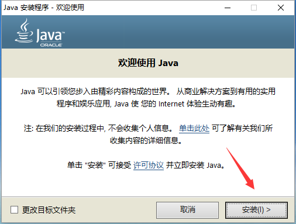

1. 等待安装 &#x20;

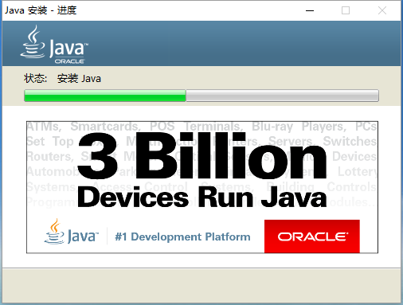

1. 安装完成，点击“关闭” &#x20;

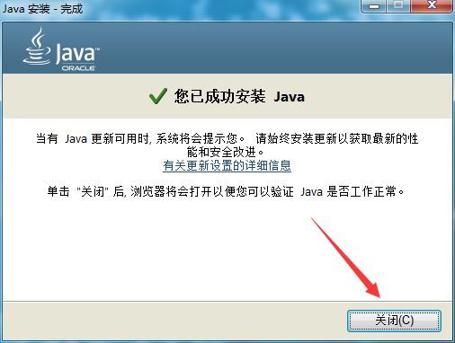

### ST官方下载STM32CubeMX

官网可以下载最新版本的软件，STM32CubeMX的网址放在下方了\
[STM32CubeMX](https://www.st.com/content/st\_com/en/products/development-tools/software-development-tools/stm32-software-development-tools/stm32-configurators-and-code-generators/stm32cubemx.html#get-software)

根据自己的电脑系统选择即可

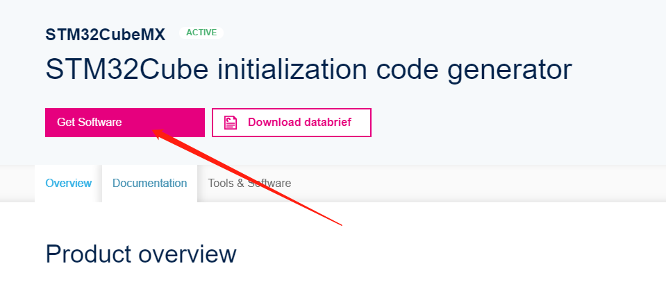

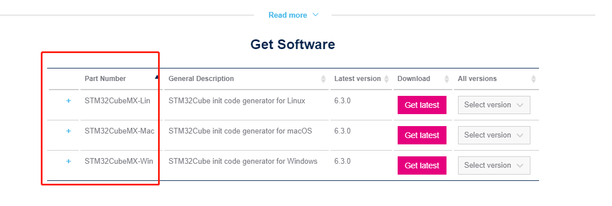

### STM32CubeMX的安装

安装STM32CubeMX很简单，基本上一路“Next”下去就行了。 本手册采用Windows系统为例来讲述安装过程。

1. 右击“SetupSTM32CubeMX-4.17.0.exe” &#x20;

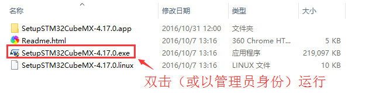

1. 点击"Next" &#x20;

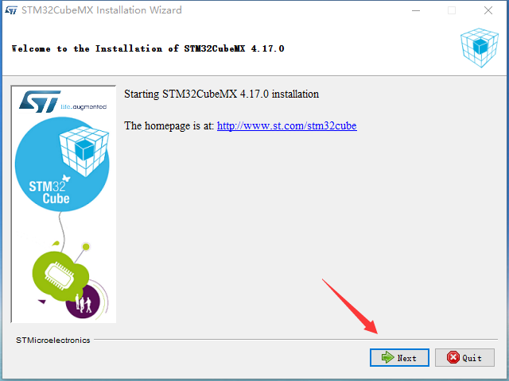

1. 选择“I accept the terms...”,点击“Next”&#x20;

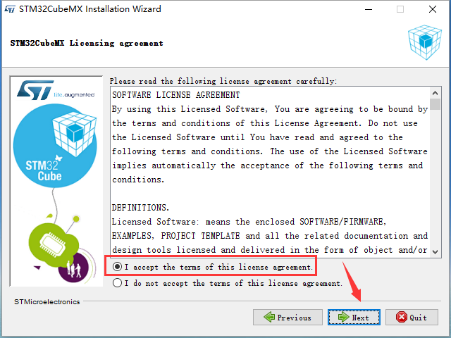

1.  选择安装路径（这里修改D盘），点击“Next” &#x20;

    (建议在D盘或者C盘下创建一个software的文件夹用来安装软件)&#x20;

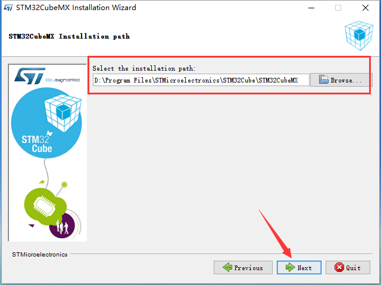

1.  提示创建安装目录，点击“确定”   &#x20;

    (如果你已经创建了路径中的文件夹就不会有这个提示) &#x20;

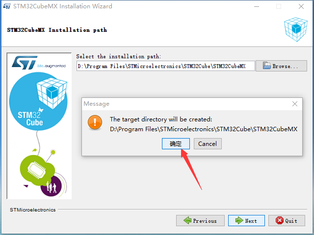

1. 勾选快捷方式，点击“Next”&#x20;

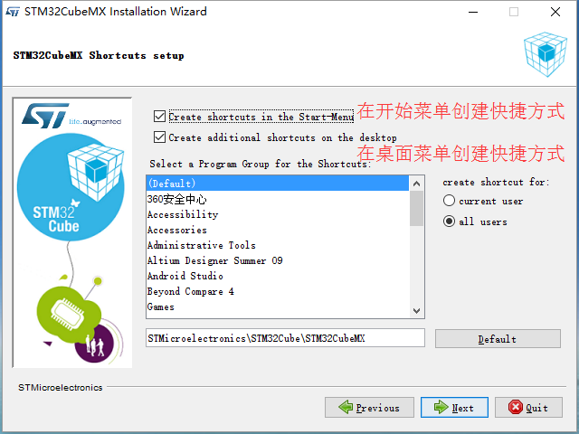

1. 等待安装进度完成，点击“Next” &#x20;

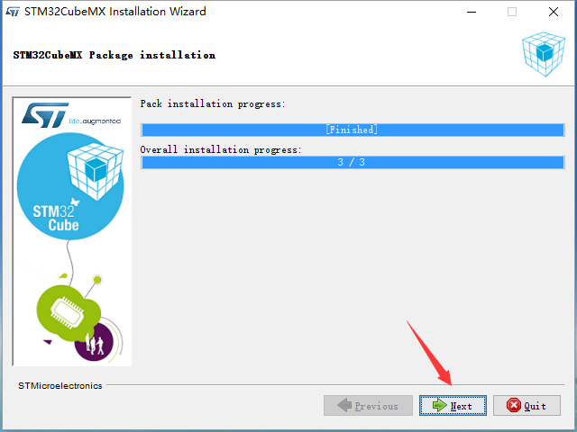

1. 点击“Done”，至此已经完成STM32CubeMX的安装&#x20;

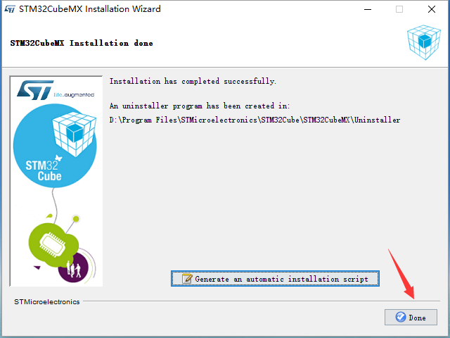

### STM32CubeMX库的安装

STM32CubeMX库（固件支持包）的安装方式有三种：通过STM32CubeMX软件在线安装、导入离线包、解压离线包。\
本文仅介绍通过STM32CubeMX软件在线安装

1. 打开安装好的STM32CubeMX软件 点击(Help),如下图 &#x20;

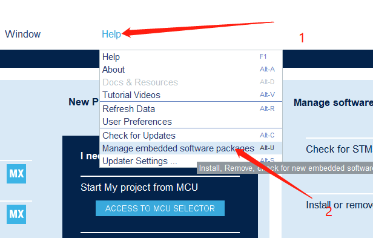

1.  点击黑色箭头,展开列表 &#x20;

    (此处我们选择安装stm32F1XX的芯片包,因为我们硬件平台使用的是stm32f103rct6)&#x20;

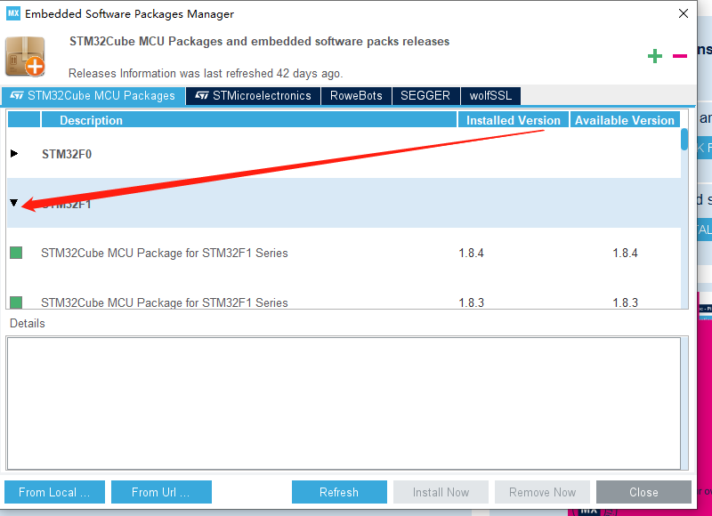

1. 点击空白的方格,选择自己需要的芯片包(建议选择最新版本),然后点击"Install Now"立即安装,等待安装完成即可.

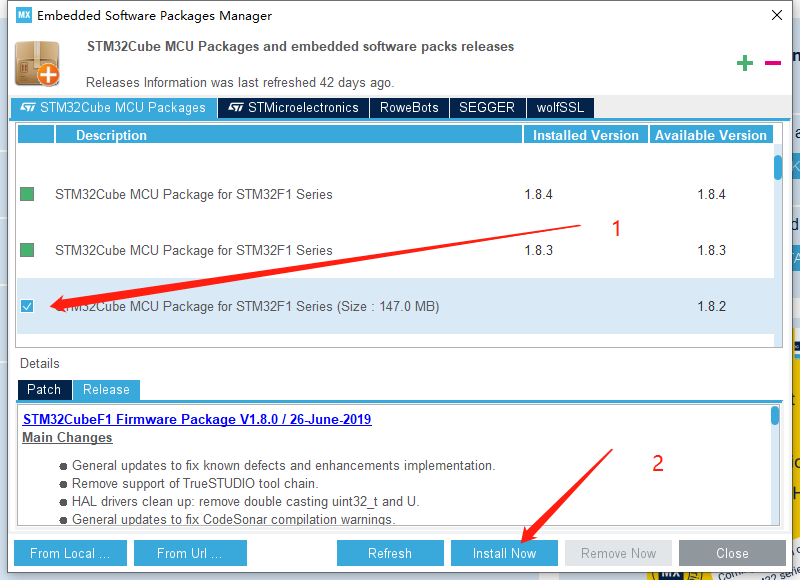
