# 3.1  跑马灯实验

硬件平台：stm32F103RCT6  (正点原子 mini开发板)  
软件平台：stm32cubeMX 6.2.1 + MDK5.15

以后均是该平台,本篇之后不再赘述

本篇分为三个部分:
 * 硬件设计
 * 软件设计
 * 下载验证

## 3.1.1 硬件设计

本章用到的硬件只有<b>LED</b> (<b>DS0</b>和 <b>DS1</b>）。其 电路在 ALIENTEK MiniSTM32开发板上 默认
是 已经连接好了 的 。 <b>DS0</b>接 <b>PA8</b>, <b>DS1</b>接 <b>PD2</b>。所以在硬件上不需要动任何东西。

其连接原理图如下：

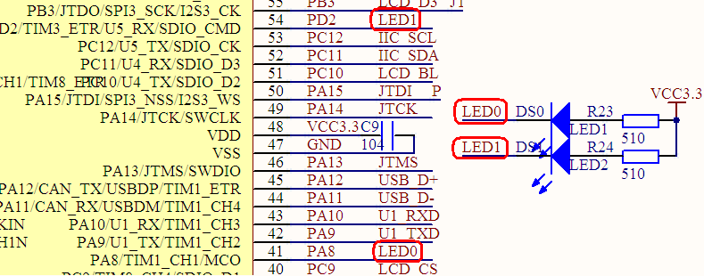  

## 3.1.2 软件设计  

本章实验顺序基本上是参考与<b><< STM32不完全手册HAL库版本 >></b>,略有删减.但本文是采用了STM32CuBeMX图形化配置工具进行初始化的.所以内容与<b><< STM32不完全手册HAL库版本 >></b>相比 较为简单与浅显.

### 创建工程

这是我们学习的第一个实验,所以我会手把手的教大家从头创建工程, 之后就不再讲解如何创建工程了.忘记的读者可以回到此处再次查看.

1. 打开STM32CubeMX
  
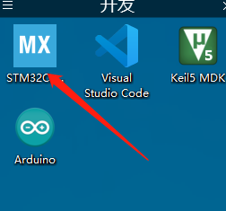

2. 打开后我们会看到以下界面,点击 <b>Start My project from MCU</b>  来选择我们的MCU型号来创建工程  
(我们mini开发板采用的MCU是STM32F103RCT6)

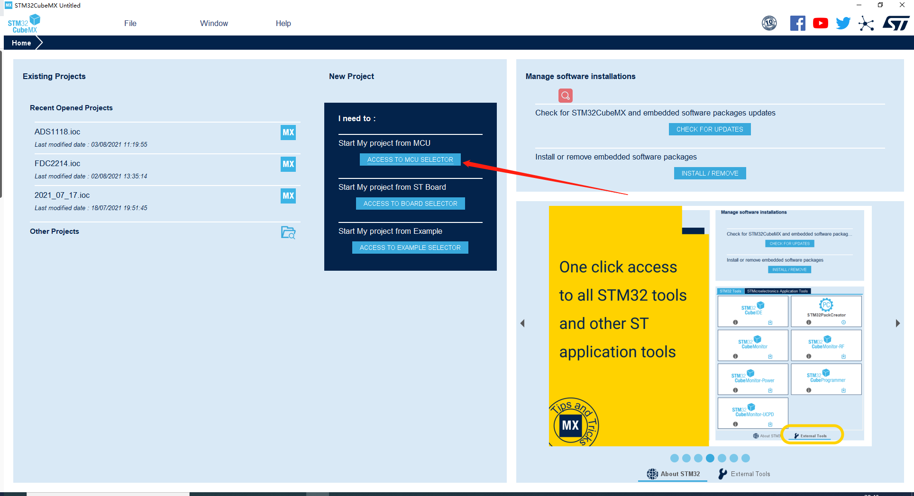

3. 在此处填入我们的芯片型号<b>stm32f103rc</b>并双击<b>STM32F103RCTx</b>(箭头所指位置)

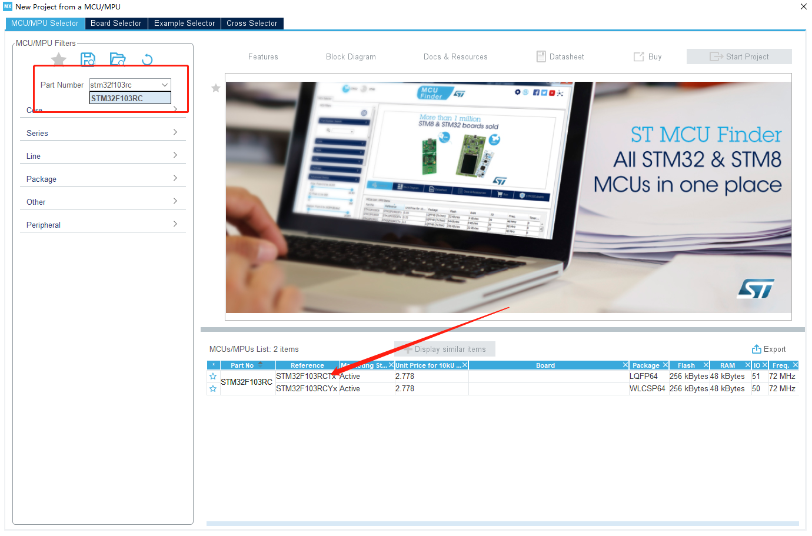

4. 选择完芯片后我们点击<b>File</b> - <b>Save Project</b>来保存当前工程  
也可以稍后再保存,但是还是建议创建了工程就保存.   

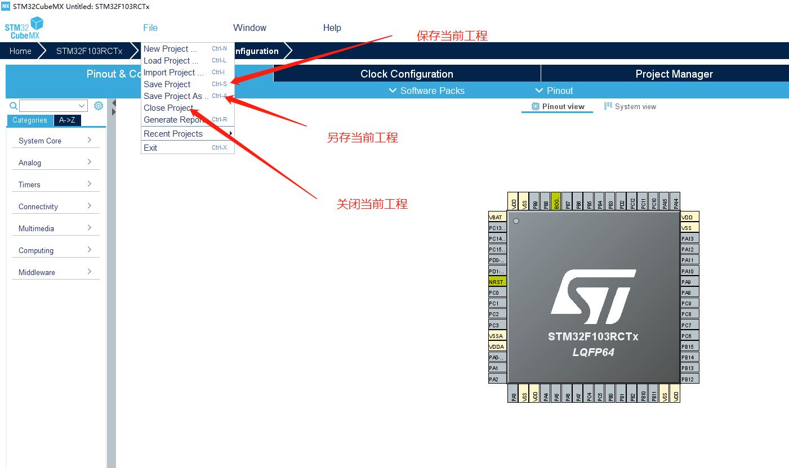

5. 点击<b>保存</b>后会弹出以下窗口: 
    
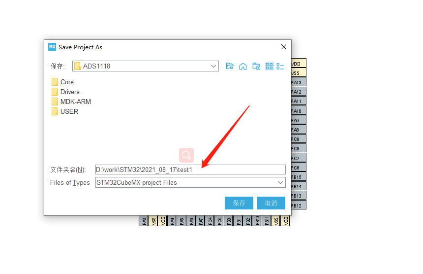  

以截图为例, 箭头处填入工程保存的路径, 点击<b>保存</b>按钮即可,(最后的<b>test1</b>为工程名)  
(建议创建一个<b>work</b>或者<b>stm32</b>的文件夹专门用来放工程)

### 配置芯片

1. 配置<b>RCC</b>, 时钟源选择  
这里使用的是配置了<b>外部高速时钟</b> 

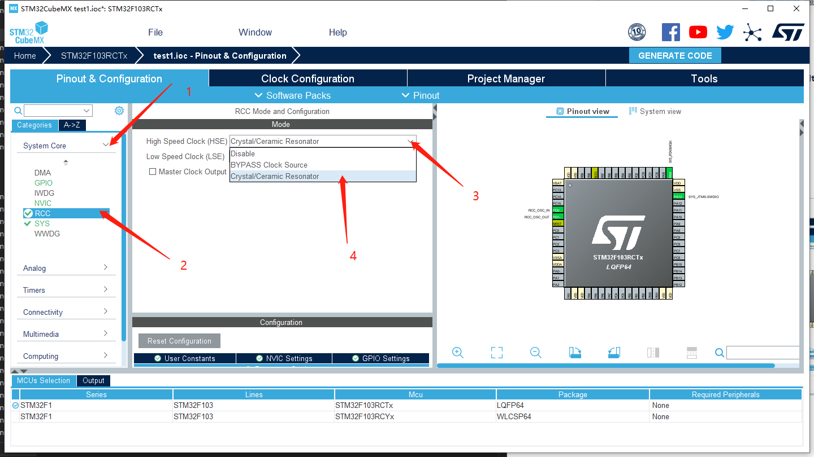

2. 配置SYS, 配置下载接口  
这里使用的是<b>SWD</b>(Serial Wire Debug)方式下载  

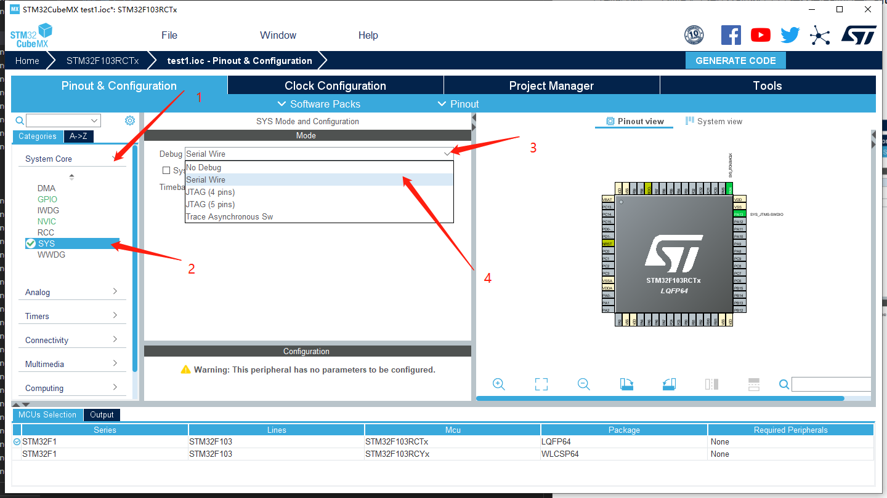

3. 配置PA8引脚为输出模式  
如图:   

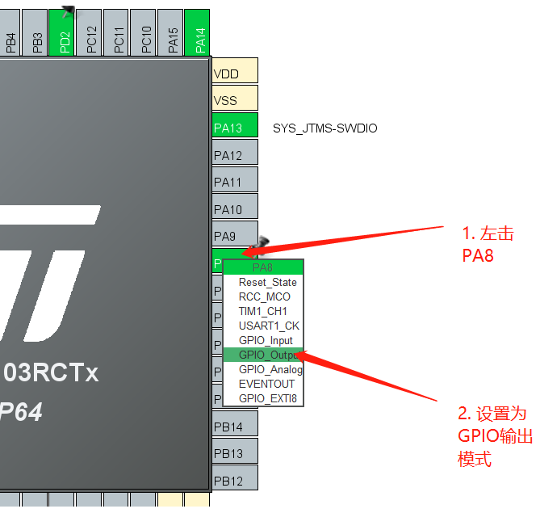  

4. 给PA8引脚设置一个用户标签LED0(方便我们使用与记忆)  

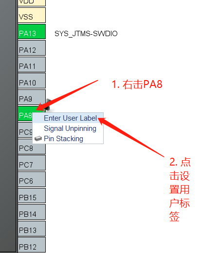

5. 设置IDE(集成开发环境)为 MDK5  

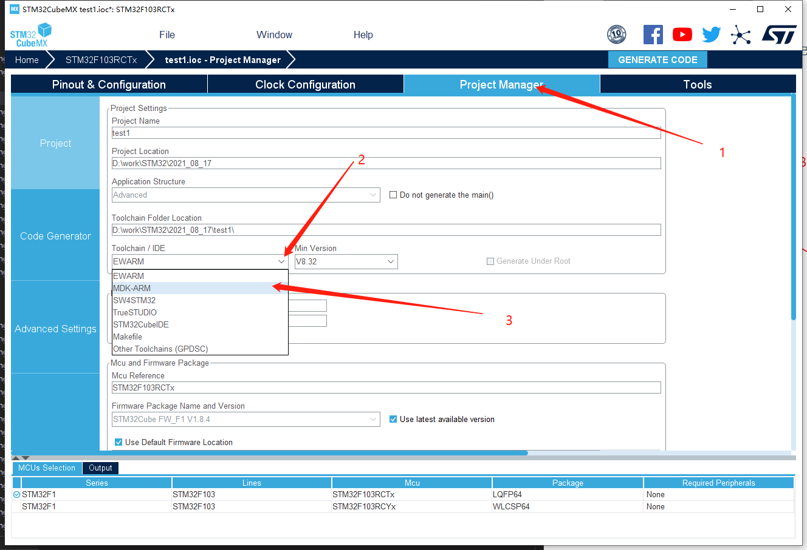

6. 配置工程代码生成选项  

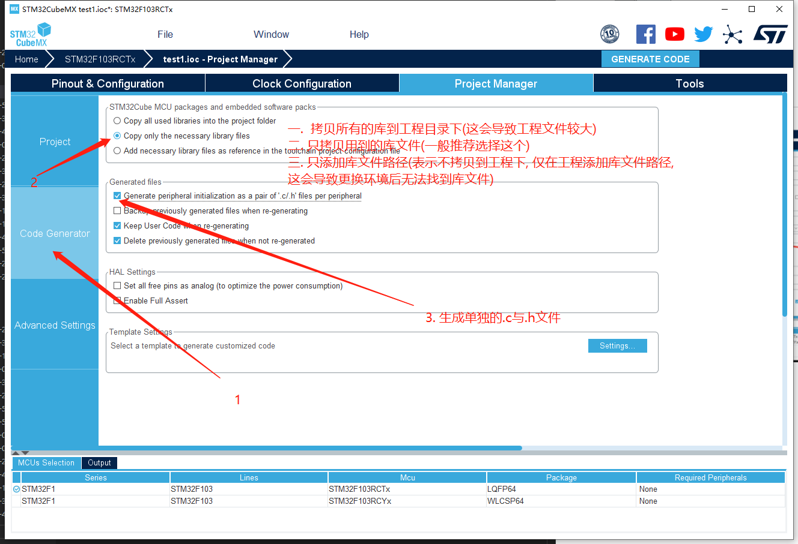

7. 点击生成按钮后打开工程,具体如图:  

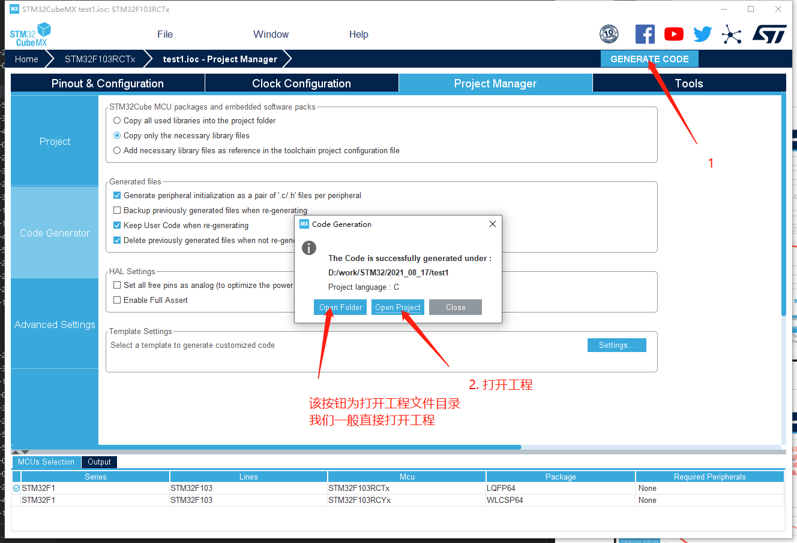

### 编写程序

现在我们用keil5打开了工程,建议进行一次全局编译.具体如图  

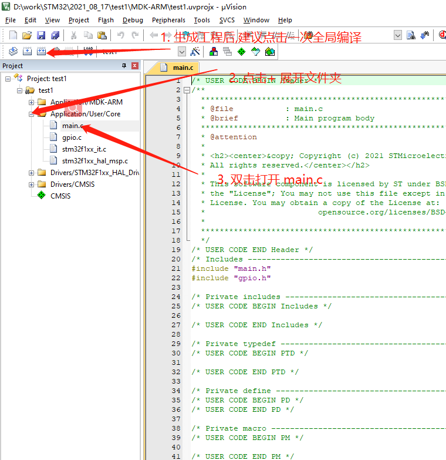

我们将代码写在<b>whil(1)</b>循环内, 因为我们需要一直执行这段代码  
(注意: 我们需要将代码写在<b>BEGIN</b>与<b>END</b>之间, 防止使用CuBeMX再次生成后导致代码消失)

程序流程图,如下:  

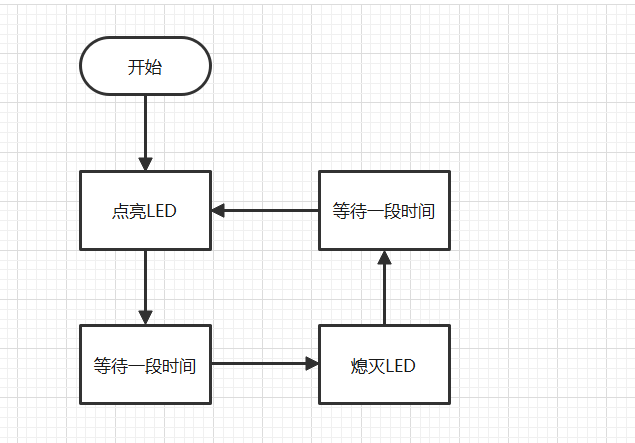

代码如下:

```C
HAL_GPIO_WritePin(LED0_GPIO_Port,LED0_Pin,0); //将LED0引脚写入一个低电平
HAL_Delay(500);//等待500ms
HAL_GPIO_WritePin(LED0_GPIO_Port,LED0_Pin,1);//将LED0引脚写入一个高电平
HAL_Delay(500);
```

这样一个最基础的实验我们就完成了
实现的效果就是D0亮500ms灭500ms

关于高电平点亮LED还是低电平点亮LED需要结合电路图  
电路图在上方

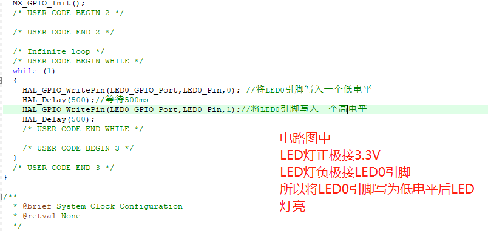

## 3.1.3 下载验证

编写完工程后我们点击编译,等待编译完成后进行下载.  
下载完成后,我们按下开发板上的复位按钮, 可以看到, 开发板上的D0亮500ms灭500ms

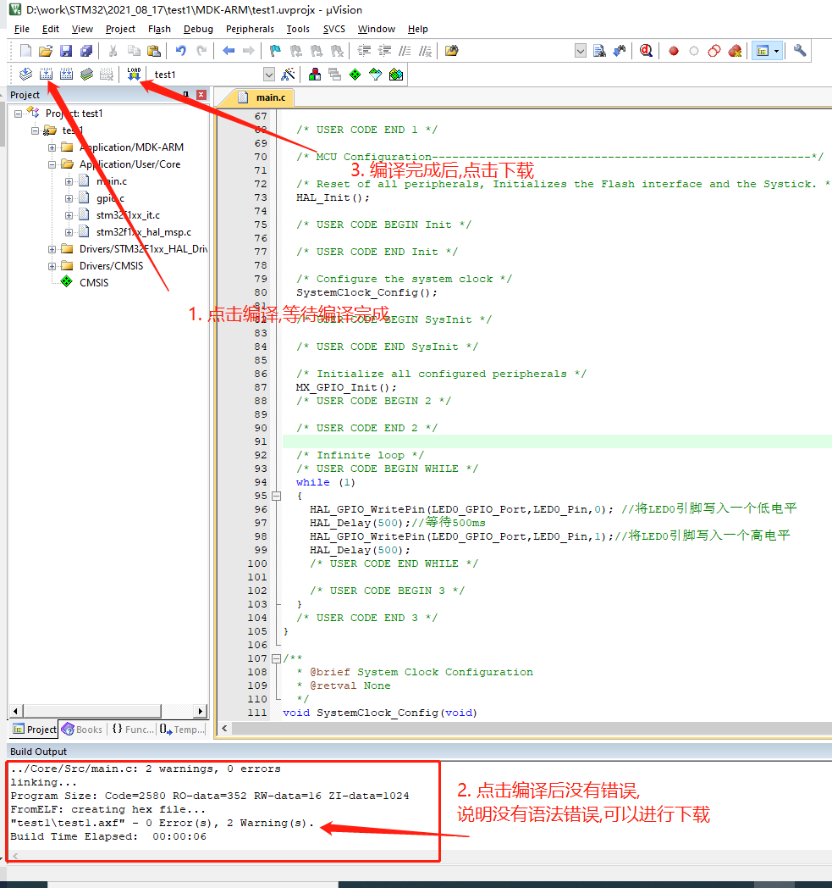
