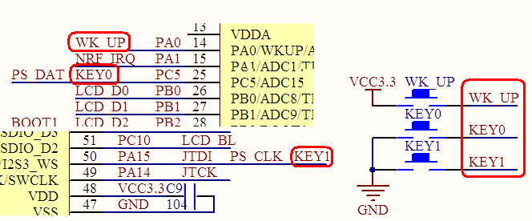
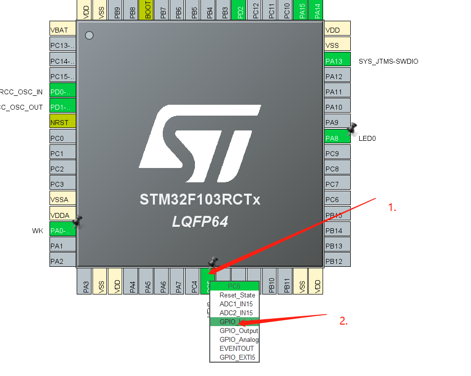
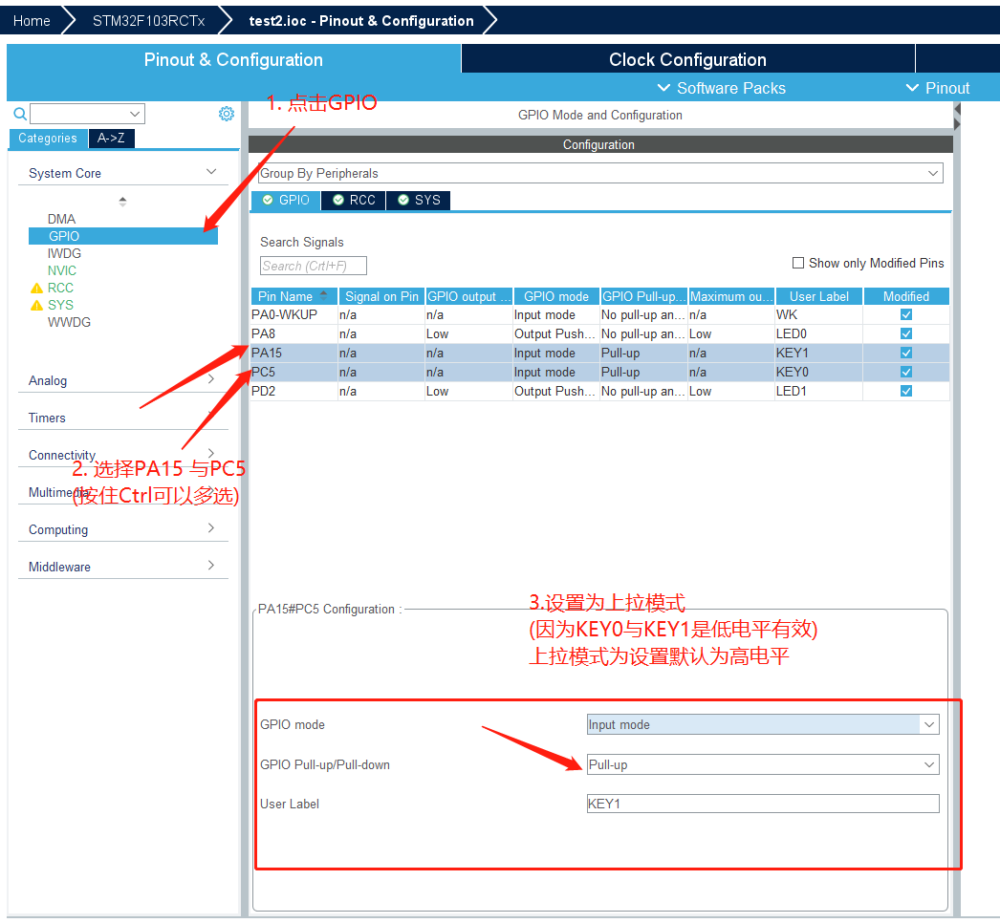
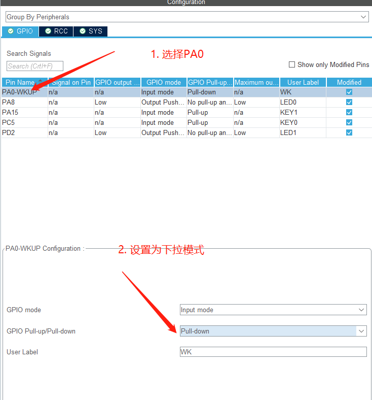
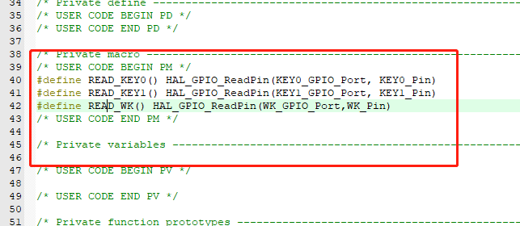
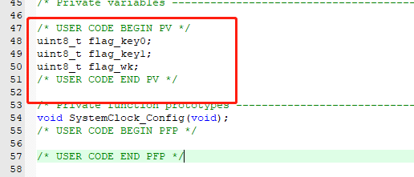
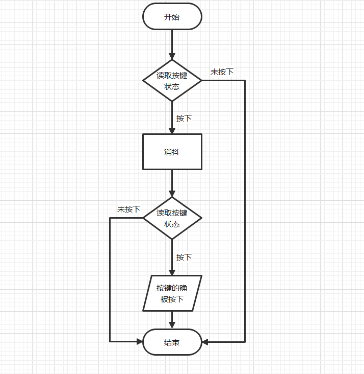
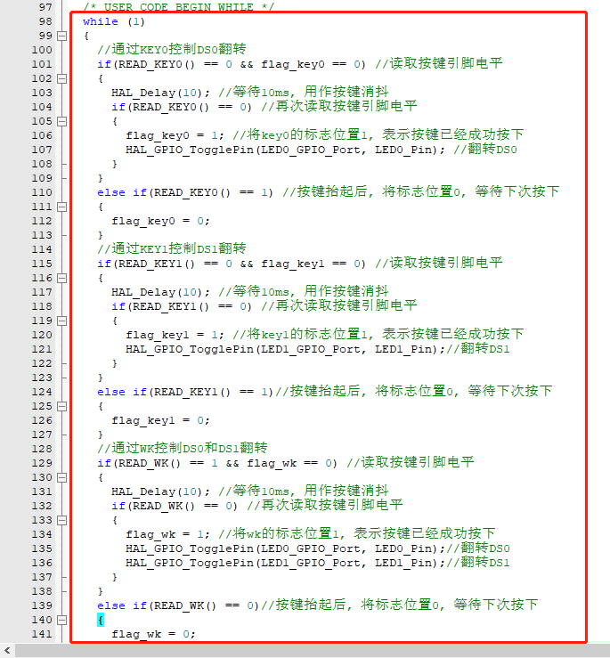

# 3.2  按键输入实验

## 3.2.1 STM32 IO口简介

STM32的 IO口在上一 章 已经有了详细的介绍，这里我们不再多说。 STM32的 IO口做输
入使用的时候，是通过读取 IDR的内容来读取 IO口的状态的。了解了这点，就可以开始我们
的代码编写了。  
这一节，我们将通过 MiniSTM32开发 板上载有的 3个按钮 (KEY0/KEY1/WK_UP)，来控
制板上的 2个 LED，其中 KEY0控制 DS0，按一次亮，再按一次，就灭。 KEY1控制 DS1，效
果同 KEY0。 WK_UP按键则 同时控制 DS0和 DS1，按一次，他们的状态就翻转一次。

## 3.2.2 硬件设计

本实验用到的硬件资源有：
1. 指示灯 <b>DS0</b>、 <b>DS1</b>  
2. 3个按键： <b>KEY0</b>、 <b>KEY1</b>和 <b>KEY_UP</b>。  
<b>DS0</b>、 <b>DS1</b>和 <b>STM32</b>的连接在上 一章 已经介绍 了，在 <b>MiniSTM32</b>开发板上的按键 <b>KEY0</b>连接 在<b>PC5</b>上、 <b>KEY1</b>连 接在 <b>PA15</b>上 、 <b>WK_UP</b>连 接在<b>PA0</b>上。 如图 7.2.1所示：



这里需要注意的是<b>KEY0</b>和<b>KEY1</b>是低电平有效的，而<b>WK_UP</b>是高电平有效的， 除了<b>KEY1</b>有上拉电阻（与 <b>JTDI</b>共用），其他两个 都没有上下拉电阻，所以，需要在 <b>STM32</b>内部设置上下拉。

## 3.2.3 软件设计

### 创建工程

创建工程本篇不再赘述, 如果有不会创建工程的读者, 请重复阅读 <b>3.1 跑马灯实验</b>

### 配置芯片

1. 配置<b>RCC</b>, 配置<b>SYS</b>与<b>3.1 跑马灯实验</b> 相同, 所以本篇不再赘述

2. 配置PA8引脚为输出模式,PD2同理.  
如图:   

  

3. 给PA8引脚设置一个用户标签(LED0)(方便我们使用与记忆)  
给PD2引脚设置一个用户标签(LED1)


至此我们已经配置完了两个LED所连接的引脚, 接下来我们配置按键所连接的引脚

4. 将三个按键所连接的引脚(<b>PC5, PA15, PA0</b>), 均配置为输入模式  
具体如图:  



5. 配置按键引脚的上下拉

<b>KEY0</b>和 <b>KEY1</b>是低电平有效的，而<b>WK_UP</b>是高电平有效的， 除了
<b>KEY1</b>有上拉电阻（与 JTDI共用），其他两个都没有上下拉电阻，所以，需要在STM32内部设
置上下拉。



将WK_UP键设置为下拉模式



6. 至此该工程初始化已经全部设置完成.

7. 配置工程代码生成选项  


8. 点击生成按钮后打开工程,具体如图:  


### 编写程序

部分常规操作比如生成完后进行一次全局编译等, 我们此处不再重复演示.  
直接进入编写代码

1. 为了之后编写代码方便, 我们将部分函数用宏定义的方式来表示  
HAL_GPIO_ReadPin()为读取引脚电平函数

```C
/* USER CODE BEGIN PM */
#define READ_KEY0() HAL_GPIO_ReadPin(KEY0_GPIO_Port, KEY0_Pin)
#define READ_KEY1() HAL_GPIO_ReadPin(KEY1_GPIO_Port, KEY1_Pin)
#define READ_WK() HAL_GPIO_ReadPin(WK_GPIO_Port,WK_Pin)
/* USER CODE END PM */
```



2. 增加几个变量,用作按键标志位

```C
/* USER CODE BEGIN PV */
uint8_t flag_key0;
uint8_t flag_key1;
uint8_t flag_wk; 
/* USER CODE END PV */
```



3. 编写按键检测主体代码

程序流程图,如下:  



具体代码:  

```C
/* Infinite loop */
/* USER CODE BEGIN WHILE */
while (1)
{
    //通过KEY0控制DS0翻转
    if(READ_KEY0() == 0 && flag_key0 == 0) //读取按键引脚电平
    {
        HAL_Delay(10); //等待10ms, 用作按键消抖
        if(READ_KEY0() == 0) //再次读取按键引脚电平
        {
            flag_key0 = 1; //将key0的标志位置1, 表示按键已经成功按下
            HAL_GPIO_TogglePin(LED0_GPIO_Port, LED0_Pin); //翻转DS0
        }
    }
    else if(READ_KEY0() == 1) //按键抬起后, 将标志位置0, 等待下次按下
    {
        flag_key0 = 0;
    }
    //通过KEY1控制DS1翻转
    if(READ_KEY1() == 0 && flag_key1 == 0) //读取按键引脚电平
    {
        HAL_Delay(10); //等待10ms, 用作按键消抖
        if(READ_KEY1() == 0) //再次读取按键引脚电平
        {
            flag_key1 = 1; //将key1的标志位置1, 表示按键已经成功按下
            HAL_GPIO_TogglePin(LED1_GPIO_Port, LED1_Pin);//翻转DS1
        }
    }
    else if(READ_KEY1() == 1)//按键抬起后, 将标志位置0, 等待下次按下
    {
        flag_key1 = 0;
    }
    //通过WK控制DS0和DS1翻转
    if(READ_WK() == 1 && flag_wk == 0) //读取按键引脚电平
    {
        HAL_Delay(10); //等待10ms, 用作按键消抖
        if(READ_WK() == 0) //再次读取按键引脚电平
        {
            flag_wk = 1; //将wk的标志位置1, 表示按键已经成功按下
            HAL_GPIO_TogglePin(LED0_GPIO_Port, LED0_Pin);//翻转DS0
            HAL_GPIO_TogglePin(LED1_GPIO_Port, LED1_Pin);//翻转DS1
        }
    }
    else if(READ_WK() == 0)//按键抬起后, 将标志位置0, 等待下次按下
    {
        flag_wk = 0;
    }
}
/* USER CODE END WHILE */
```




## 3.2.4 下载验证

编写完工程后我们点击编译,等待编译完成后进行下载.  

下载完成后,我们按下开发板上的复位按钮可以看到, KEY0控制 DS0，按一次亮，再按一次，就灭。 KEY1控制 DS1，效
果同 KEY0。 WK_UP按键则 同时控制 DS0和 DS1，按一次，他们的状态就翻转一次。


